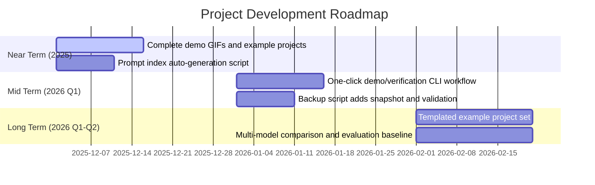

```mermaid
graph TB
  %% GitHub compatible simplified version (using only basic syntax)

  subgraph ext_layer[External Systems and Data Sources Layer]
    ext_contrib[Community Contributors]
    ext_sheet[Google Sheets / External Tables]
    ext_md[External Markdown Prompts]
    ext_api[Reserved: Other Data Sources / APIs]
    ext_contrib --> ext_sheet
    ext_contrib --> ext_md
    ext_api --> ext_sheet
  end

  subgraph ingest_layer[Data Ingestion and Collection Layer]
    excel_raw[prompt_excel/*.xlsx]
    md_raw[prompt_docs/External MD Input]
    excel_to_docs[prompts-library/scripts/excel_to_docs.py]
    docs_to_excel[prompts-library/scripts/docs_to_excel.py]
    ingest_bus[Standardized Data Frame]
    ext_sheet --> excel_raw
    ext_md --> md_raw
    excel_raw --> excel_to_docs
    md_raw --> docs_to_excel
    excel_to_docs --> ingest_bus
    docs_to_excel --> ingest_bus
  end

  subgraph core_layer[Data Processing and Intelligent Decision Layer / Core]
    ingest_bus --> validate[Field Validation and Normalization]
    validate --> transform[Format Mapping Transformation]
    transform --> artifacts_md[prompt_docs/Standardized MD]
    transform --> artifacts_xlsx[prompt_excel/Export XLSX]
    orchestrator[main.py · scripts/start_convert.py] --> validate
    orchestrator --> transform
  end

  subgraph consume_layer[Execution and Consumption Layer]
    artifacts_md --> catalog_coding[i18n/en/prompts/02-coding-prompts]
    artifacts_md --> catalog_system[i18n/en/prompts/01-system-prompts]
    artifacts_md --> catalog_meta[i18n/en/prompts/00-meta-prompts]
    artifacts_md --> catalog_user[i18n/en/prompts/03-user-prompts]
    artifacts_md --> docs_repo[i18n/en/documents/*]
    artifacts_md --> new_consumer[Reserved: Other Downstream Channels]
    catalog_coding --> ai_flow[AI Pair Programming Workflow]
    ai_flow --> deliverables[Project Context / Plan / Code Output]
  end

  subgraph ux_layer[User Interaction and Interface Layer]
    cli[CLI: python main.py] --> orchestrator
    makefile[Makefile Task Encapsulation] --> cli
    readme[README.md Usage Guide] --> cli
  end

  subgraph infra_layer[Infrastructure and Cross-cutting Capabilities Layer]
    git[Git Version Control] --> orchestrator
    backups[backups/one-click-backup.sh · backups/fast-backup.py] --> artifacts_md
    deps[requirements.txt · scripts/requirements.txt] --> orchestrator
    config[prompts-library/scripts/config.yaml] --> orchestrator
    monitor[Reserved: Logging and Monitoring] --> orchestrator
  end
```

<!--
-------------------------------------------------------------------------------
  Project Header Area (HEADER)
-------------------------------------------------------------------------------
-->
<p align="center">
  <!-- Recommended size: 1280x640px. Can be created using tools like Canva, Figma or https://banners.beyondco.de/ -->
  
</p>

<div align="center">

# Vibe Coding Guide

**The ultimate workstation for bringing ideas to life through AI pair programming**

---

<!--
  Badges Area (BADGES)
-->
<!-- Project Status Badges -->
<p>
  <a href="../../LICENSE"></a>
  <a href="https://github.com/tukuaiai/vibe-coding-cn"></a>
  <a href="https://github.com/tukuaiai/vibe-coding-cn"></a>
  <a href="https://github.com/tukuaiai/vibe-coding-cn/graphs/contributors"></a>
  <a href="https://x.com/123olp"></a>
  <a href="https://t.me/glue_coding"></a>
</p>

<!-- Multilingual Entry -->
<p>
  <a href="../zh/README.md"></a>
  <a href="../en/README.md"></a>
  <a href="../README.md"></a>
</p>

<!-- Resource Quick Links - Grouped by Importance -->
<!-- 🔴 Core Concepts (Red) -->
<p>
  <a href="./documents/01-getting-started/00-Vibe%20Coding%20Philosophy.md"></a>
  <a href="./documents/00-fundamentals/Glue%20Coding.md"></a>
  <a href="./documents/01-getting-started/README.md"></a>
  <a href="./documents/00-fundamentals/Language%20Layer%20Elements.md"></a>
  <a href="./documents/00-fundamentals/Common%20Pitfalls.md"></a>
  <a href="./documents/04-resources/External%20Resource%20Aggregation.md"></a>
</p>
<!-- 🟠 Methodology (Orange) -->
<p>
  <a href="./documents/00-fundamentals/A%20Formalization%20of%20Recursive%20Self-Optimizing%20Generative%20Systems.md"></a>
  <a href="./documents/00-fundamentals/The%20Way%20of%20Programming.md"></a>
  <a href="./documents/03-practice/README.md"></a>
</p>
<!-- 🟡 Practical Tools (Yellow/Green) -->
<p>
  <a href="./documents/04-resources/Tool%20Collection.md"></a>
</p>
<!-- 🔵 Resource Library (Blue/Purple) -->
<p>
  <a href="./prompts/"></a>
  <a href="./skills/"></a>
  <a href="https://docs.google.com/spreadsheets/d/1ngoQOhJqdguwNAilCl1joNwTje7FWWN9WiI2bo5VhpU/edit?gid=2093180351#gid=2093180351&range=A1"></a>
  <a href="https://github.com/x1xhlol/system-prompts-and-models-of-ai-tools"></a>
  <a href="../../libs/external/chat-vault/README.md"></a>
</p>

[📋 Tools & Resources](#-the-tools-qi)
[🚀 Getting Started](#-getting-started-beginners)
[⚙️ Full Setup](#️-full-setup-process)
[📞 Contact](#-contact-information)
[✨ Support](#-support-project)
[🤝 Contributing](#-contributing)

AI interpretation link for this repository: [zread.ai/tukuaiai/vibe-coding-cn](https://zread.ai/tukuaiai/vibe-coding-cn/1-overview)

</div>

## 🎲 Preface

**This is a constantly growing and self-negating project. All current experience and capabilities may become meaningless as AI evolves. So always maintain an AI-first mindset, don't be complacent, all experience may become obsolete - view it dialectically 🙏🙏🙏**

---

<details>
<summary><strong>⚡ 5-Minute Quick Start</strong></summary>

## ⚡ 5-Minute Quick Start

> Already have network and development environment? Start Vibe Coding directly!

**Step 1**: Copy the prompt below and paste it into [Claude](https://claude.ai/) or [ChatGPT](https://chatgpt.com/)

```
You are a professional AI programming assistant. I want to develop a project using the Vibe Coding approach.

Please ask me first:
1. What project do you want to build? (one sentence description)
2. What programming languages are you familiar with? (it's okay if you're not familiar with any)
3. What is your operating system?

Then help me:
1. Recommend the simplest tech stack
2. Generate project structure
3. Guide me step by step to complete development

Requirement: After completing each step, ask me if it was successful before continuing to the next step.
```

**Step 2**: Follow AI's guidance to turn your ideas into reality 🚀

**That's it!** Read on for more advanced content 👇

</details>

---

## 🚀 Getting Started (Beginners)

Complete beginner? Follow these steps in order:

0. [00-Vibe Coding Philosophy](./documents/01-getting-started/00-Vibe%20Coding%20Philosophy.md) - Understand core concepts
1. [01-Network Environment Configuration](./documents/01-getting-started/01-Network%20Environment%20Configuration.md) - Configure network access
2. [02-Development Environment Setup](./documents/01-getting-started/02-Development%20Environment%20Setup.md) - Copy prompts to AI, let AI guide you
3. [03-IDE Configuration](./documents/01-getting-started/03-IDE%20Configuration.md) - Configure VS Code editor

---

<details open>
<summary><strong>🧬 Glue Coding</strong></summary>

> **The Holy Grail and Silver Bullet of Software Engineering**

Glue Coding is the ultimate evolution of Vibe Coding, potentially solving three fatal flaws:

| Problem | Solution |
|:---|:---|
| 🎭 AI Hallucination | ✅ Only use verified mature code, zero hallucination |
| 🧩 Complexity Explosion | ✅ Every module is a battle-tested wheel |
| 🎓 High Barrier | ✅ You only need to describe "how to connect" |

**Core Philosophy**: Copy instead of write, connect instead of create, reuse instead of reinvent.

👉 [Learn more about Glue Coding](./documents/00-fundamentals/Glue%20Coding.md)

</details>

---

## 🖼️ Overview

**Vibe Coding** is the ultimate workflow for AI pair programming, designed to help developers smoothly bring ideas to life. This guide details the entire process from project conception, technology selection, implementation planning to specific development, debugging, and expansion. It emphasizes **planning-driven** and **modularization** as the core, preventing AI from going out of control and leading to project chaos.

> **Core Philosophy**: *Planning is everything.* Be cautious about letting AI autonomously plan, otherwise your codebase will become an unmanageable mess.

**Note**: The following experience sharing is not universally applicable. Please adopt it dialectically in specific practices combined with your scenario.

## 🔑 Meta-Methodology

The core of this philosophy is to build an AI system capable of **self-optimization**. Its recursive nature can be broken down into the following steps:

> Further reading: [A Formalization of Recursive Self-Optimizing Generative Systems](./documents/00-fundamentals/A%20Formalization%20of%20Recursive%20Self-Optimizing%20Generative%20Systems.md)

#### 1. Define Core Roles:

*   **α-Prompt (Generator)**: A "parent" prompt whose sole responsibility is to **generate** other prompts or skills.
*   **Ω-Prompt (Optimizer)**: Another "parent" prompt whose sole responsibility is to **optimize** other prompts or skills.

#### 2. Describe the Recursive Lifecycle:

1.  **Bootstrap**:
    *   Use AI to generate initial versions (v1) of `α-Prompt` and `Ω-Prompt`.

2.  **Self-Correction & Evolution**:
    *   Use `Ω-Prompt (v1)` to **optimize** `α-Prompt (v1)`, thereby obtaining a more powerful `α-Prompt (v2)`.

3.  **Generation**:
    *   Use the **evolved** `α-Prompt (v2)` to generate all required target prompts and skills.

4.  **Recursive Loop**:
    *   Feed the newly generated, more powerful products (including new versions of `Ω-Prompt`) back into the system, again for optimizing `α-Prompt`, thereby initiating continuous evolution.

#### 3. Ultimate Goal:

Through this continuous **recursive optimization loop**, the system achieves **self-transcendence** in each iteration, infinitely approaching the preset **expected state**.

## 🧭 The Way (Dao)

* **If AI can do it, don't do it manually.**
* **Ask AI everything.**
* **Purpose-driven: All actions in the development process revolve around "purpose".**
* **Context is the primary element of Vibe Coding; garbage in, garbage out.**
* **Systemic thinking: entities, links, functions/purposes, three dimensions.**
* **Data and functions are everything in programming.**
* **Input, process, output describe the entire process.**
* **Frequently ask AI: What is it? Why? How to do it?**
* **Structure first, then code; always plan the framework well, otherwise, technical debt will be endless.**
* **Occam's Razor: Do not add code if unnecessary.**
* **Pareto Principle: Focus on the important 20%.**
* **Reverse thinking: First clarify your requirements, then build code reversely from requirements.**
* **Repeat, try multiple times, if it really doesn't work, open a new window.**
* **Focus, extreme focus can penetrate code; do one thing at a time (except for divine beings).**


## 🧩 The Method (Fa)

* **One-sentence goal + non-goals.**
* **Orthogonality: functionality should not be too repetitive (this depends on the scenario).**
* **Copy, don't write: don't reinvent the wheel, first ask AI if there's a suitable repository, download and modify it.**
* **Always read the official documentation; first, feed the official documentation to AI.**
* **Split modules by responsibility.**
* **Interfaces first, implementation later.**
* **Change only one module at a time.**
* **Documentation is context, not an afterthought.**

## 🛠️ The Techniques (Shu)

* Clearly state: **What can be changed, what cannot be changed.**
* Debug only provide: **Expected vs. Actual + Minimum Reproduction.**
* Testing can be handed over to AI, **assertions human-reviewed.**
* Too much code, **switch sessions.**

## 📋 The Tools (Qi)

### Integrated Development Environment (IDE) & Terminal

*   [**Visual Studio Code**](https://code.visualstudio.com/): A powerful integrated development environment, suitable for code reading and manual modifications. Its `Local History` plugin is particularly convenient for project version management.
*   **Virtual Environment (.venv)**: Highly recommended for one-click configuration and isolation of project environments, especially for Python development.
*   [**Cursor**](https://cursor.com/): Has already captured user mindshare and is widely known.
*   [**Warp**](https://www.warp.dev/): A modern terminal integrated with AI features, effectively improving command-line operations and error troubleshooting efficiency.
*   [**Neovim (nvim)**](https://github.com/neovim/neovim): A high-performance modern Vim editor with a rich plugin ecosystem, the first choice for keyboard-driven developers.
*   [**LazyVim**](https://github.com/LazyVim/LazyVim): A configuration framework based on Neovim, pre-configured with LSP, code completion, debugging, and other full-featured functionalities, achieving a balance between out-of-the-box usability and deep customization.

### AI Models & Services

*   [**Claude Opus 4.5**](https://claude.ai/new): A powerful AI model, offered through platforms like Claude Code, and supporting CLI and IDE plugins.
*   [**gpt-5.1-codex.1-codex (xhigh)**](https://chatgpt.com/codex/): An AI model suitable for handling large projects and complex logic, usable through platforms like Codex CLI.
*   [**Droid**](https://factory.ai/news/terminal-bench): Provides CLI access to various models including Claude Opus 4.5.
*   [**Kiro**](https://kiro.dev/): Currently offers free access to the Claude Opus 4.5 model, and provides client and CLI tools.
*   [**Gemini CLI**](https://geminicli.com/): Provides free access to the Gemini model, suitable for executing scripts, organizing documents, and exploring ideas.
*   [**antigravity**](https://antigravity.google/): Currently a free AI service provided by Google, supporting Claude Opus 4.5 and Gemini 3.0 Pro.
*   [**AI Studio**](https://aistudio.google.com/prompts/new_chat): A free service provided by Google, supporting Gemini 3.0 Pro and Nano Banana.
*   [**Gemini Enterprise**](https://cloud.google.com/gemini-enterprise): Google's AI service for enterprise users, currently available for free.
*   [**GitHub Copilot**](https://github.com/copilot): An AI code completion tool jointly developed by GitHub and OpenAI.
*   [**Kimi K2**](https://www.kimi.com/): A domestic AI model suitable for various general tasks.
*   [**GLM**](https://bigmodel.cn/): A domestic large language model developed by Zhipu AI.
*   [**Qwen**](https://qwenlm.github.io/qwen-code-docs/zh/cli/): An AI model developed by Alibaba, its CLI tool offers free usage quota.

### Development and Auxiliary Tools

*   [**Augment**](https://app.augmentcode.com/): Provides powerful context engine and prompt optimization features.
*   [**Windsurf**](https://windsurf.com/): An AI development tool offering free credits to new users.
*   [**Ollama**](https://ollama.com/): A local large model management tool that allows easy pulling and running of open-source models via the command line.
*   [**Mermaid Chart**](https://www.mermaidchart.com/): Used to convert text descriptions into visual diagrams like architecture diagrams and sequence diagrams.
*   [**NotebookLM**](https://notebooklm.google.com/): A tool for AI interpretation of materials, audio, and generating mind maps.
*   [**Zread**](https://zread.ai/): An AI-driven GitHub repository reading tool that helps quickly understand project code.
*   [**tmux**](https://github.com/tmux/tmux): A powerful terminal multiplexer that supports session persistence, splitting panes, and background tasks, ideal for server and multi-project development.
*   [**DBeaver**](https://dbeaver.io/): A universal database management client that supports various databases and offers comprehensive features.

### Resources and Templates

*   [**Prompt Library (Online Table)**](https://docs.google.com/spreadsheets/d/1ngoQOhJqdguwNAilCl1joNwTje7FWWN9WiI2bo5VhpU/edit?gid=2093180351#gid=2093180351&range=A1): An online table containing a large number of ready-to-use prompts for various categories.
*   [**Third-party System Prompt Learning Library**](https://github.com/x1xhlol/system-prompts-and-models-of-ai-tools): For learning and referencing system prompts of other AI tools.
*   [**Skills Maker**](https://github.com/yusufkaraaslan/Skill_Seekers): A tool for generating customized skills based on requirements.
*   [**Meta-Prompts**](https://docs.google.com/spreadsheets/d/1ngoQOhJqdguwNAilCl1joNwTje7FWWN9WiI2bo5VhpU/edit?gid=1770874220#gid=1770874220): Advanced prompts for generating prompts.
*   [**General Project Architecture Template**](./documents/00-fundamentals/General%20Project%20Architecture%20Template.md): Can be used to quickly set up standardized project directory structures.
*   [**Meta-Skill: Skills of Skills**](./skills/claude-skills/SKILL.md): A meta-skill for generating skills.
*   [**tmux Shortcut Cheatsheet**](./documents/02-methodology/tmux%20Shortcut%20Cheatsheet.md): Reference documentation for tmux shortcuts.
*   [**LazyVim Shortcut Cheatsheet**](./documents/02-methodology/LazyVim%20Shortcut%20Cheatsheet.md): Reference documentation for LazyVim shortcuts.
*   [**Erge's Java Advanced Path**](https://javabetter.cn/): Contains detailed configuration tutorials for various development tools.
*   [**Virtual Card**](https://www.bybit.com/cards/?ref=YDGAVPN&source=applet_invite): Can be used for registering cloud services and other scenarios requiring international payments.

---

## Coding Model Performance Tier Reference

It is recommended to only choose models from the first tier for complex tasks to ensure optimal results and efficiency.

*   **Tier 1**: `codex-5.1-max-xhigh`, `claude-opus-4.5-xhigh`, `gpt-5.2-xhigh`
*   **Tier 2**: `claude-sonnet-4.5`, `kimi-k2-thinking`, `minimax-m2`, `glm-4.6`, `gemini-3.0-pro`, `gemini-2.5-pro`
*   **Tier 3**: `qwen3`, `SWE`, `grok4`

---

## 📚 Related Documents and Resources

*   **Community**:
    *   [Telegram Group](https://t.me/glue_coding)
    *   [Telegram Channel](https://t.me/tradecat_ai_channel)
*   **Personal Sharing**:
    *   [My Learning Experience](./documents/02-methodology/Learning%20Experience.md)
    *   [Recommended Programming Books](./documents/04-resources/Recommended%20Programming%20Books.md)
*   **Core Resources**:
    *   [**Meta-Prompt Library**](https://docs.google.com/spreadsheets/d/1ngoQOhJqdguwNAilCl1joNwTje7FWWN9WiI2bo5VhpU/edit?gid=1770874220#gid=1770874220): A collection of advanced prompts for generating prompts.
    *   [**Meta-Skill**](./skills/claude-skills/SKILL.md): A skill for generating skills.
    *   [**Skills Library**](./skills): A modular skill repository that can be directly integrated.
    *   [**Skill Generator**](https://github.com/yusufkaraaslan/Skill_Seekers): A tool to convert any material into agent-usable skills.
    *   [**Online Prompt Database**](https://docs.google.com/spreadsheets/d/1ngoQOhJqdguwNAilCl1joNwTje7FWWN9WiI2bo5VhpU/edit?gid=2093180351#gid=2093180351&range=A1): An online table containing hundreds of user and system prompts for various scenarios.
    *   [**Third-party System Prompt Repository**](https://github.com/x1xhlol/system-prompts-and-models-of-ai-tools): Gathers system prompts from various AI tools.
*   **Internal Project Documentation**:
    *   [**prompts-library Tool Description**](../../libs/external/prompts-library/): This tool supports converting prompts between Excel and Markdown formats, and includes hundreds of selected prompts.
    *   [**coding_prompts Collection**](./prompts/02-coding-prompts/): Dedicated prompts for the Vibe Coding process.
    *   [**System Prompt Construction Principles**](./documents/00-fundamentals/System%20Prompt%20Construction%20Principles.md): A comprehensive guide on how to build efficient and reliable AI system prompts.
    *   [**Development Experience Summary**](./documents/00-fundamentals/Development%20Experience.md): Includes practical experience on variable naming, file structure, coding standards, and architectural principles.
    *   [**General Project Architecture Template**](./documents/00-fundamentals/General%20Project%20Architecture%20Template.md): Provides standard directory structures and best practices for various project types.
    *   [**Augment MCP Configuration Document**](./documents/02-methodology/auggie-mcp%20Configuration%20Document.md): Detailed configuration instructions for the Augment context engine.
    *   [**system_prompts Collection**](./prompts/01-system-prompts/): System prompts used to guide AI development, including multiple versions of development specifications and thinking frameworks.

---

### Project Directory Structure Overview

The core structure of this `vibe-coding-cn` project primarily revolves around knowledge management and the organization and automation of AI prompts. Below is a reorganized and simplified directory tree with explanations for each part:

```
.
├── CODE_OF_CONDUCT.md           # Community code of conduct, regulating contributor behavior.
├── CONTRIBUTING.md              # Contribution guide, explaining how to contribute to this project.
├── GEMINI.md                    # AI assistant context document, including project overview, tech stack, and file structure.
├── LICENSE                      # Open-source license file.
├── Makefile                     # Project automation scripts for code checking, building, etc.
├── README.md                    # Main project documentation, including project overview, usage guide, resource links, etc.
├── .gitignore                   # Git ignore file.
├── AGENTS.md                    # AI agent related documentation or configuration.
├── CLAUDE.md                    # Core behavioral guidelines or configuration for the AI assistant.
│
├── i18n/en/documents/           # Stores various explanatory documents, experience summaries, and detailed configuration instructions.
│   ├── 00-fundamentals/             # Core concepts and methodology
│   ├── 01-getting-started/          # Getting started guides
│   ├── 02-methodology/              # Tools and tutorials
│   ├── 03-practice/                 # Practice projects
│   └── 04-resources/                # Templates and resources
│
├── libs/                        # General library code for internal project modularization.
│   ├── common/                  # Common functional modules.
│   │   ├── models/              # Model definitions.
│   │   │   └── __init__.py
│   │   └── utils/               # Utility functions.
│   │       └── backups/         # Internal backup tools.
│   ├── database/                # Database related modules.
│   │   └── .gitkeep             # Placeholder file, ensuring the directory is tracked by Git.
│   └── external/                # External integration modules.
│       ├── my-nvim/             # User's Neovim configuration.
│       ├── prompts-library/     # Prompt library management tool (Excel-Markdown conversion).
│       │   ├── main.py          # Main entry for the prompt library management tool.
│       │   ├── scripts/         # Contains Excel and Markdown conversion scripts and configurations.
│       │   ├── prompt_excel/    # Stores raw prompt data in Excel format.
│       │   ├── prompt_docs/     # Stores Markdown prompt documents converted from Excel.
│       │   └── ... (other prompts-library internal files)
│       └── XHS-image-to-PDF-conversion/ # Xiaohongshu image to PDF conversion tool.
│
├── i18n/en/prompts/             # Centralized storage for all types of AI prompts.
│   ├── 00-meta-prompts/             # Meta prompts (prompts that generate prompts)
│   ├── 01-system-prompts/           # AI system-level prompts for behavior and framework
│   │   └── ... (system prompts)
│   │
│   ├── 02-coding-prompts/           # Prompts for programming and code generation
│   │   └── ... (coding prompt files)
│   │
│   └── 03-user-prompts/             # User-defined or commonly used prompts
│       └── ... (user prompts)
│
├── i18n/en/skills/              # Centralized storage for all types of skills.
    ├── 00-meta-skills/              # Meta skills
    │   └── claude-skills/           # Skills generator
    ├── 01-ai-tools/                 # AI CLI tools
    │   ├── claude-code-guide/
    │   └── claude-cookbooks/
    ├── 02-databases/                # Database skills
    │   ├── postgresql/
    │   └── timescaledb/
    ├── 03-crypto/                   # Cryptocurrency/quantitative
    │   ├── ccxt/
    │   ├── coingecko/
    │   ├── cryptofeed/
    │   ├── hummingbot/
    │   └── polymarket/
    └── 04-dev-tools/                # Development tools
        ├── telegram-dev/
        ├── twscrape/
        ├── snapdom/
        └── proxychains/
```

---

## 🖼️ Overview and Demo

In one sentence: Vibe Coding = **Planning-driven + Context-fixed + AI Pair Execution**, transforming "idea to maintainable code" into an auditable pipeline, rather than an uniteratable monolith.

**What you will get:**
- A systematic prompt toolchain: `i18n/en/prompts/01-system-prompts/` defines AI behavioral boundaries, `i18n/en/prompts/02-coding-prompts/` provides full-link scripts for demand clarification, planning, and execution.
- Closed-loop delivery path: Requirement → Context document → Implementation plan → Step-by-step implementation → Self-testing → Progress recording, fully reviewable and transferable.

## ⚙️ Architecture and Workflow

Core Asset Mapping:
```
i18n/en/prompts/
  00-meta-prompts/          # Meta prompts for generating prompts
  01-system-prompts/        # System-level prompts constraining AI behavior
  02-coding-prompts/        # Core prompts for demand clarification, planning, and execution
  03-user-prompts/          # Reusable user-side prompts
i18n/en/documents/
  Templates and Resources/Code Organization.md, Templates and Resources/General Project Architecture Template.md, Methodology and Principles/Development Experience.md, Methodology and Principles/System Prompt Construction Principles.md, and other knowledge bases.
backups/
  one-click-backup.sh, fast-backup.py  # Local/remote snapshot scripts.
```



---

<details>
<summary>📈 Performance Benchmarks (Optional)</summary>

This repository is positioned as a "workflow and prompts" library rather than a performance-oriented codebase. It is recommended to track the following observable metrics (currently primarily relying on manual recording, which can be scored/marked in `progress.md`):

| Metric | Meaning | Current Status/Suggestion |
|:---|:---|:---|
| Prompt Hit Rate | Proportion of generations that meet acceptance criteria on the first try | To be recorded; mark 0/1 after each task in progress.md |
| Turnaround Time | Time required from requirement to first runnable version | Mark timestamps during screen recording, or use CLI timer to track |
| Change Reproducibility | Whether context/progress/backup is updated synchronously | Manual update; add git tags/snapshots to backup scripts |
| Routine Coverage | Presence of minimum runnable examples/tests | Recommend keeping README + test cases for each example project |

</details>

---

## 🗺️ Roadmap



---

## 🚀 Getting Started

### 🆕 Absolute Beginner? Start Here!

1. [01-Network Environment Configuration](./documents/01-getting-started/01-Network%20Environment%20Configuration.md) - Configure network access
2. [02-Development Environment Setup](./documents/01-getting-started/02-Development%20Environment%20Setup.md) - Copy prompts to AI, let AI guide you through environment setup
3. [03-IDE Configuration](./documents/01-getting-started/03-IDE%20Configuration.md) - Configure VS Code editor

### Already have a development environment?

To start Vibe Coding, you only need one of the following two tools:
- **Claude Opus 4.5**, used in Claude Code
- **gpt-5.1-codex.1-codex (xhigh)**, used in Codex CLI

This guide applies to both the CLI terminal version and the VSCode extension version (both Codex and Claude Code have extensions, and their interfaces are updated).

*(Note: Earlier versions of this guide used **Grok 3**, later switched to **Gemini 2.5 Pro**, and now we are using **Claude 4.5** (or **gpt-5.1-codex.1-codex (xhigh)**))*

*(Note 2: If you want to use Cursor, please check version [1.1](https://github.com/EnzeD/vibe-coding/tree/1.1.1) of this guide, but we believe it is currently less powerful than Codex CLI or Claude Code)*

---

<details>
<summary><strong>⚙️ Full Setup Process</strong></summary>

<details>
<summary><strong>1. Game Design Document</strong></summary>

- Hand your game idea to **gpt-5.1-codex** or **Claude Opus 4.5** to generate a concise **Game Design Document** in Markdown format, named `game-design-document.md`.
- Review and refine it yourself to ensure it aligns with your vision. It can be very basic initially; the goal is to provide AI with the game structure and intent context. Do not over-design; it will be iterated later.
</details>

<details>
<summary><strong>2. Tech Stack and <code>CLAUDE.md</code> / <code>Agents.md</code></strong></summary>

- Ask **gpt-5.1-codex** or **Claude Opus 4.5** to recommend the most suitable tech stack for your game (e.g., ThreeJS + WebSocket for a multiplayer 3D game), save it as `tech-stack.md`.
  - Ask it to propose the **simplest yet most robust** tech stack.
- Open **Claude Code** or **Codex CLI** in your terminal and use the `/init` command. It will read the two `.md` files you've created and generate a set of rules to guide the large model correctly.
- **Key: Always review the generated rules.** Ensure the rules emphasize **modularization** (multiple files) and prohibit **monolithic files**. You may need to manually modify or supplement the rules.
  - **Extremely Important:** Some rules must be set to **"Always"** to force AI to read them before generating any code. For example, add the following rules and mark them as "Always":
    > ```
    > # Important Note:
    > # Before writing any code, you must fully read memory-bank/@architecture.md (including full database structure).
    > # Before writing any code, you must fully read memory-bank/@game-design-document.md.
    > # After completing a major feature or milestone, you must update memory-bank/@architecture.md.
    > ```
  - Other (non-Always) rules should guide AI to follow best practices for your tech stack (e.g., networking, state management).
  - *If you want the cleanest code and most optimized project, this entire set of rule settings is mandatory.*
</details>

<details>
<summary><strong>3. Implementation Plan</strong></summary>

- Provide the following to **gpt-5.1-codex** or **Claude Opus 4.5**:
  - Game Design Document (`game-design-document.md`)
  - Tech Stack Recommendation (`tech-stack.md`)
- Ask it to generate a detailed **Implementation Plan** (Markdown format), containing a series of step-by-step instructions for AI developers.
  - Each step should be small and specific.
  - Each step must include tests to verify correctness.
  - Strictly no code - only write clear, specific instructions.
  - Focus on the **basic game** first; full features will be added later.
</details>

<details>
<summary><strong>4. Memory Bank</strong></summary>

- Create a new project folder and open it in VSCode.
- Create a subfolder `memory-bank` in the project root.
- Place the following files into `memory-bank`:
  - `game-design-document.md`
  - `tech-stack.md`
  - `implementation-plan.md`
  - `progress.md` (create an empty file to record completed steps)
  - `architecture.md` (create an empty file to record the purpose of each file)
</details>

</details>

<details>
<summary><strong>🎮 Vibe Coding Develops the Basic Game</strong></summary>

Now for the most exciting part!

<details>
<summary><strong>Ensure Everything is Clear</strong></summary>

- Open **Codex** or **Claude Code** in the VSCode extension, or launch Claude Code / Codex CLI in the project terminal.
- Prompt: Read all documents in `/memory-bank`. Is `implementation-plan.md` completely clear? What questions do you have for me to clarify, so that it is 100% clear to you?
- It will usually ask 9-10 questions. After answering all of them, ask it to modify `implementation-plan.md` based on your answers to make the plan more complete.
</details>

<details>
<summary><strong>Your First Implementation Prompt</strong></summary>

- Open **Codex** or **Claude Code** (extension or terminal).
- Prompt: Read all documents in `/memory-bank`, then execute step 1 of the implementation plan. I will be responsible for running tests. Do not start step 2 until I verify the tests pass. After verification, open `progress.md` to record what you've done for future developers' reference, and add new architectural insights to `architecture.md` explaining the purpose of each file.
- **Always** use "Ask" mode or "Plan Mode" (press `shift+tab` in Claude Code) first, and only let AI execute the step after you are satisfied.
- **Ultimate Vibe:** Install [Superwhisper](https://superwhisper.com) and chat casually with Claude or gpt-5.1-codex using voice, without typing.
</details>

<details>
<summary><strong>Workflow</strong></summary>

- After completing step 1:
  - Commit changes to Git (ask AI if you don't know how).
  - Start a new chat (`/new` or `/clear`).
  - Prompt: Read all files in memory-bank, read progress.md to understand previous work progress, then continue with step 2 of the implementation plan. Do not start step 3 until I verify the tests.
- Repeat this process until the entire `implementation-plan.md` is completed.
</details>

</details>

<details>
<summary><strong>✨ Adding Detail Features</strong></summary>

Congratulations! You've built a basic game! It might still be rough and lack features, but now you can experiment and refine it as much as you want.
- Want fog effects, post-processing, special effects, sound effects? A better plane/car/castle? A beautiful sky?
- For each major feature added, create a new `feature-implementation.md` with short steps + tests.
- Continue incremental implementation and testing.

</details>

<details>
<summary><strong>🐞 Fixing Bugs and Getting Stuck</strong></summary>

<details>
<summary><strong>General Fixes</strong></summary>

- If a prompt fails or breaks the project:
  - Use `/rewind` in Claude Code to revert; for gpt-5.1-codex, commit frequently with Git and reset when needed.
- Error handling:
  - **JavaScript errors:** Open browser console (F12), copy error, paste to AI; for visual issues, send a screenshot.
  - **Lazy solution:** Install [BrowserTools](https://browsertools.agentdesk.ai/installation) to automatically copy errors and screenshots.
</details>

<details>
<summary><strong>Difficult Issues</strong></summary>

- Really stuck:
  - Revert to the previous git commit (`git reset`), try again with a new prompt.
- Extremely stuck:
  - Use [RepoPrompt](https://repoprompt.com/) or [uithub](https://uithub.com/) to synthesize the entire codebase into one file, then send it to **gpt-5.1-codex or Claude** for help.
</details>

</details>

<details>
<summary><strong>💡 Tips and Tricks</strong></summary>

<details>
<summary><strong>Claude Code & Codex Usage Tips</strong></summary>

- **Terminal version of Claude Code / Codex CLI:** Run in VSCode terminal to directly view diffs and feed context without leaving the workspace.
- **Claude Code's `/rewind`:** Instantly revert to a previous state when iteration goes off track.
- **Custom commands:** Create shortcuts like `/explain $param` to trigger prompts: "Analyze the code in depth to thoroughly understand how $param works. Tell me after you understand, then I will give you a new task." This allows the model to fully load context before modifying code.
- **Clean up context:** Frequently use `/clear` or `/compact` (to retain conversation history).
- **Time-saving trick (use at your own risk):** Use `claude --dangerously-skip-permissions` or `codex --yolo` to completely disable confirmation pop-ups.
</details>

<details>
<summary><strong>Other Useful Tips</strong></summary>

- **Small modifications:** Use gpt-5.1-codex (medium)
- **Write top-tier marketing copy:** Use Opus 4.1
- **Generate excellent 2D sprites:** Use ChatGPT + Nano Banana
- **Generate music:** Use Suno
- **Generate sound effects:** Use ElevenLabs
- **Generate videos:** Use Sora 2
- **Improve prompt effectiveness:**
  - Add a sentence: "Think slowly, no rush, it's important to strictly follow my instructions and execute perfectly. If my expression is not precise enough, please ask."
  - In Claude Code, the intensity of keywords to trigger deep thinking: `think` < `think hard` < `think harder` < `ultrathink`.
</details>

</details>

<details>
<summary><strong>❓ Frequently Asked Questions (FAQ)</strong></summary>

- **Q: I'm making an app, not a game, is the process the same?**
  - **A:** Essentially the same! Just replace GDD with PRD (Product Requirement Document). You can also quickly prototype with v0, Lovable, Bolt.new, then move the code to GitHub, and clone it locally to continue development using this guide.

- **Q: Your air combat game's plane model is amazing, but I can't make it with just one prompt!**
  - **A:** That wasn't one prompt, it was ~30 prompts + a dedicated `plane-implementation.md` file guided it. Use precise instructions like "cut space for ailerons on the wing," instead of vague instructions like "make a plane."

- **Q: Why are Claude Code or Codex CLI stronger than Cursor now?**
  - **A:** It's entirely a matter of personal preference. We emphasize that Claude Code can better leverage the power of Claude Opus 4.5, and Codex CLI can better leverage the power of gpt-5.1-codex. Cursor does not utilize either of these as well as their native terminal versions. Terminal versions can also work in any IDE, with SSH remote servers, etc., and features like custom commands, sub-agents, and hooks can significantly improve development quality and speed in the long run. Finally, even if you only have a low-tier Claude or ChatGPT subscription, it's completely sufficient.

- **Q: What if I don't know how to set up a multiplayer game server?**
  - **A:** Ask your AI.

</details>

---

## 📞 Contact Information

-   **GitHub**: [tukuaiai](https://github.com/tukuaiai)
-   **Twitter / X**: [123olp](https://x.com/123olp)
-   **Telegram**: [@desci0](https://t.me/desci0)
-   **Telegram Group**: [glue_coding](https://t.me/glue_coding)
-   **Telegram Channel**: [tradecat_ai_channel](https://t.me/tradecat_ai_channel)
-   **Email**: tukuai.ai@gmail.com (replies might be delayed)

---

## ✨ Support Project

Please help us, thank you, good people will live long and peaceful lives 🙏🙏🙏

-   **Tron (TRC20)**: `TQtBXCSTwLFHjBqTS4rNUp7ufiGx51BRey`
-   **Solana**: `HjYhozVf9AQmfv7yv79xSNs6uaEU5oUk2USasYQfUYau`
-   **Ethereum (ERC20)**: `0xa396923a71ee7D9480b346a17dDeEb2c0C287BBC`
-   **BNB Smart Chain (BEP20)**: `0xa396923a71ee7D9480b346a17dDeEb2c0C287BBC`
-   **Bitcoin**: `bc1plslluj3zq3snpnnczplu7ywf37h89dyudqua04pz4txwh8z5z5vsre7nlm`
-   **Sui**: `0xb720c98a48c77f2d49d375932b2867e793029e6337f1562522640e4f84203d2e`
-   **Binance UID**: `572155580`

---

### ✨ Contributors

Thanks to all developers who contributed to this project!

<a href="https://github.com/tukuaiai/vibe-coding-cn/graphs/contributors">
  
  
</a>

<p>Special thanks to the following members for their valuable contributions (in no particular order):<br/>
<a href="https://x.com/shao__meng">@shao__meng</a> |
<a href="https://x.com/0XBard_thomas">@0XBard_thomas</a> |
<a href="https://x.com/Pluvio9yte">@Pluvio9yte</a> |
<a href="https://x.com/xDinoDeer">@xDinoDeer</a> |
<a href="https://x.com/geekbb">@geekbb</a>
<a href="https://x.com/GitHub_Daily">@GitHub_Daily</a>
</p>

---

## 🤝 Contributing

We warmly welcome all forms of contributions. If you have any ideas or suggestions for this project, please feel free to open an [Issue](https://github.com/tukuaiai/vibe-coding-cn/issues) or submit a [Pull Request](https://github.com/tukuaiai/vibe-coding-cn/pulls).

Before you start, please take the time to read our [**Contribution Guide (CONTRIBUTING.md)**](CONTRIBUTING.md) and [**Code of Conduct (CODE_OF_CONDUCT.md)**](CODE_OF_CONDUCT.md).

---

## 📜 License

This project is licensed under the [MIT](LICENSE) license.

---

<div align="center">

**If this project is helpful to you, please consider giving it a Star ⭐!**

## Star History

<a href="https://www.star-history.com/#tukuaiai/vibe-coding-cn&type=date&legend=top-left">
 <picture>
   <source media="(prefers-color-scheme: dark)" srcset="https://api.star-history.com/svg?repos=tukuaiai/vibe-coding-cn&type=date&theme=dark&legend=top-left" />
   <source media="(prefers-color-scheme: light)" srcset="https://api.star-history.com/svg?repos=tukuaiai/vibe-coding-cn&type=date&legend=top-left" />
   
 </picture>
</a>

---

**Crafted with dedication by [tukuaiai](https://github.com/tukuaiai), [Nicolas Zullo](https://x.com/NicolasZu), and [123olp](https://x.com/123olp)**

[⬆ Back to Top](#vibe-coding-guide)
</div>