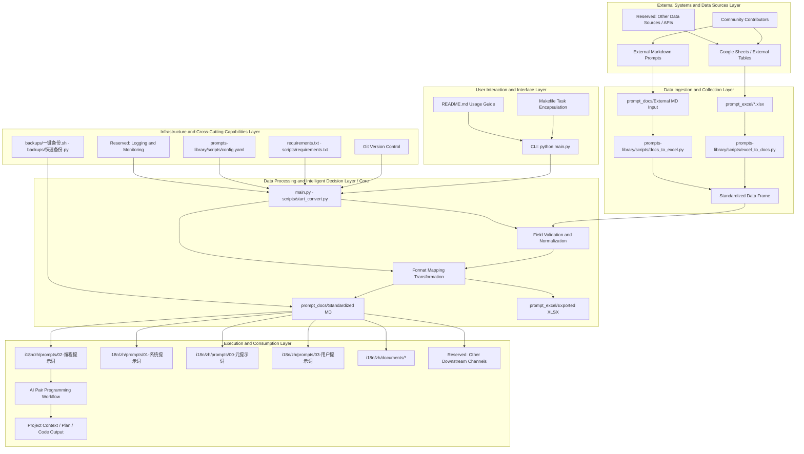
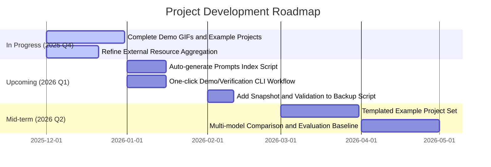

Here is the translated content of the `README.md` file:

```markdown
<!--
-------------------------------------------------------------------------------
  Project Header Area (HEADER)
-------------------------------------------------------------------------------
-->
<p align="center">
  <!-- Recommended size: 1280x640px. Can be made with tools like Canva, Figma or https://banners.beyondco.de/ -->
  
</p>

<div align="center">

# Vibe Coding Guide

**The ultimate workstation to turn ideas into reality through AI pair programming**

---

<!--
  Badges Area (BADGES)
-->
<!-- Project Status Badges -->
<p>
  <a href="LICENSE"></a>
  <a href="https://github.com/tukuaiai/vibe-coding-cn"></a>
  <a href="https://github.com/tukuaiai/vibe-coding-cn"></a>
  <a href="https://x.com/123olp"></a>
  <a href="https://t.me/glue_coding"></a>
</p>

<!-- Multilingual Entry -->
<p>
  <a href="./i18n/zh/README.md"></a>
  <a href="./i18n/en/README.md"></a>
  <a href="./i18n/README.md"></a>
</p>

<!-- Direct Resources - Grouped by Importance -->
<!-- 🔴 Core Concepts (Red Series) -->
<p>
  <a href="./i18n/zh/documents/01-入门指南/00-Vibe%20Coding%20哲学原理.md"></a>
  <a href="./i18n/zh/documents/00-基础指南/胶水编程.md"></a>
  <a href="./i18n/zh/documents/01-入门指南/README.md"></a>
  <a href="./i18n/zh/documents/00-基础指南/语言层要素.md"></a>
  <a href="./i18n/zh/documents/00-基础指南/常见坑汇总.md"></a>
  <a href="./i18n/zh/documents/00-基础指南/强前置条件约束.md"></a>
  <a href="./i18n/zh/documents/04-资源/外部资源聚合.md"></a>
  <a href="./i18n/zh/documents/00-基础指南/A%20Formalization%20of%20Recursive%20Self-Optimizing%20Generative%20Systems.md"></a>
  <a href="./i18n/zh/documents/00-基础指南/编程之道.md"></a>
  <a href="./i18n/zh/documents/03-实战/README.md"></a>
  <a href="./i18n/zh/documents/04-资源/工具集.md"></a>
  <a href="./i18n/zh/prompts/"></a>
  <a href="./i18n/zh/skills/"></a>
  <a href="https://docs.google.com/spreadsheets/d/1ngoQOhJqdguwNAilCl1joNwTje7FWWN9WiI2bo5VhpU/edit?gid=2093180351#gid=2093180351&range=A1"></a>
  <a href="https://github.com/x1xhlol/system-prompts-and-models-of-ai-tools"></a>
  <a href="./libs/external/chat-vault/README_CN.md"></a>
</p>

[📋 Tools & Resources](#-器-工具与资源)
[🚀 Get Started](#-从零开始)
[🎯 Original Repo Translation](#-原仓库翻译)
[⚙️ Full Setup Process](#️-完整设置流程)
[📞 Contact Info](#-联系方式)
[✨ Support Project](#-支持项目)
[🤝 Contribute](#-参与贡献)

AI interpretation link for this repository: [zread.ai/tukuaiai/vibe-coding-cn](https://zread.ai/tukuaiai/vibe-coding-cn/1-overview)

</div>

## 🎲 Foreword

**This is a constantly growing and self-negating project. All current experience and capabilities may become meaningless due to the evolution of AI capabilities. Therefore, please always maintain an AI-first mindset, do not be complacent, all experience may become invalid, view it dialectically🙏🙏🙏**

---

<details>
<summary><strong>⚡ 5 Minute Quickstart</strong></summary>

## ⚡ 5 Minute Quickstart

> Already have an internet and development environment? Start Vibe Coding directly!

**Step 1**: Copy the prompt below and paste it into [Claude](https://claude.ai/) or [ChatGPT](https://chatgpt.com/)

```
You are a professional AI programming assistant. I want to develop a project using Vibe Coding.

Please ask me first:
1. What project do you want to work on? (Describe in one sentence)
2. What programming languages are you familiar with? (No worries if you're not familiar)
3. What is your operating system?

Then help me:
1. Recommend the simplest tech stack
2. Generate the project structure
3. Guide me step-by-step through the development

Requirement: After each step is completed, ask me if it was successful before continuing to the next step.
```

**Step 2**: Follow the AI's guidance to turn your ideas into reality 🚀

**It's that simple!** For more advanced content, continue reading 👇

</details>

---

## 🚀 Get Started

Completely new? Follow these steps in order:

0. [00-Vibe Coding Philosophical Principles](./i18n/zh/documents/01-入门指南/00-Vibe%20Coding%20哲学原理.md) - Understand the core concepts
1. [01-Network Environment Configuration](./i18n/zh/documents/01-入门指南/01-网络环境配置.md) - Configure network access
2. [02-Development Environment Setup](./i18n/zh/documents/01-入门指南/02-开发环境搭建.md) - Copy the prompt to AI and let AI guide you through setting up the environment
3. [03-IDE Configuration](./i18n/zh/documents/01-入门指南/03-IDE配置.md) - Configure VS Code editor

---

<details open>
<summary><strong>🧬 Glue Coding</strong></summary>

> **The Holy Grail and Silver Bullet of Software Engineering**

Glue coding is the ultimate evolved form of Vibe Coding, potentially perfectly solving three fatal flaws:

| Problem | Solution |
|:---|:---|
| 🎭 AI Hallucinations | ✅ Only use validated mature code, zero hallucinations |
| 🧩 Complexity Explosion | ✅ Each module is a battle-tested wheel |
| 🎓 High Barrier to Entry | ✅ You only need to describe the "connection method" |

**Core Concept**: Copy, don't write. Connect, don't build. Reuse, don't originate.

👉 [Learn more about Glue Coding](./i18n/zh/documents/00-基础指南/胶水编程.md)

</details>

---

## 🖼️ Overview

**Vibe Coding** is the ultimate AI pair programming workflow designed to help developers smoothly turn ideas into reality. This guide details the entire process from project conception, tech stack selection, implementation planning to specific development, debugging, and expansion, emphasizing **plan-driven** and **modularization** as the core to prevent AI from losing control and causing project chaos.

> **Core Concept**: *Planning is everything.* Be cautious about letting AI plan autonomously, otherwise your codebase will turn into an unmanageable mess.

**Note**: The experiences shared below are not universally applicable. Please integrate them dialectically with specific scenarios in your practice.

<details open>
<summary><strong>🔑 Meta-Methodology</strong></summary>


The core of this idea is to build an AI system capable of **self-optimization**. Its recursive nature can be broken down into the following steps:

> Further reading: [A Formalization of Recursive Self-Optimizing Generative Systems](./i18n/zh/documents/00-基础指南/A%20Formalization%20of%20Recursive%20Self-Optimizing%20Generative%20Systems.md)

#### 1. Define Core Roles:

*   **α-Prompt (Generator)**: A "mother" prompt whose sole responsibility is to **generate** other prompts or skills.
*   **Ω-Prompt (Optimizer)**: Another "mother" prompt whose sole responsibility is to **optimize** other prompts or skills.

#### 2. Describe the Recursive Lifecycle:

1.  **Bootstrap**:
    *   Use AI to generate initial versions (v1) of `α-Prompt` and `Ω-Prompt`.

2.  **Self-Correction & Evolution**:
    *   Use `Ω-Prompt (v1)` to **optimize** `α-Prompt (v1)`, resulting in a more powerful `α-Prompt (v2)`.

3.  **Generation**:
    *   Use the **evolved** `α-Prompt (v2)` to generate all required target prompts and skills.

4.  **Recursive Loop**:
    *   Feed the newly generated, more powerful artifacts (including new versions of `Ω-Prompt`) back into the system, restarting the continuous evolution to optimize `α-Prompt`.

#### 3. Ultimate Goal:

Through this continuous **recursive optimization loop**, the system achieves **self-transcendence** in each iteration, infinitely approaching the preset **desired state**.

</details>

<details open>
<summary><strong>🧭 Methodology Essentials (Dao · Fa · Shu)</strong></summary>

## 🧭 Dao (The Way)

* **If AI can do it, don't do it manually**
* **Ask AI about everything**
* **Purpose-driven: All actions in the development process revolve around the "purpose"**
* **Context is the first principle of vibe coding; garbage in, garbage out**
* **Systematic thinking, entities, links, functions/purposes, three dimensions**
* **Data and functions are everything in programming**
* **Input, process, output describe the entire process**
* **Ask AI "what?", "why?", "how to do it?" (Golden Circle Rule)**
* **Structure first, then code. Always plan the framework well, otherwise you'll be endlessly paying technical debt**
* **Occam's Razor, don't add code if unnecessary**
* **Pareto Principle, focus on the important 20%**
* **Reverse thinking, first clarify your requirements, then build code backward from requirements**
* **Repeat, try multiple times. If it still doesn't work, open a new window.**
* **Focus, extreme focus can penetrate code. Do one thing at a time (except for divine beings)**


## 🧩 Fa (The Method)

* **One-sentence goal + non-goals**
* **Orthogonality (context-dependent)**
* **Copy, don't write. Don't reinvent the wheel. First ask AI if there's a suitable repository, download and modify it (a new paradigm for glue coding)**
* **Always read the official documentation. First scrape the official documentation and feed it to AI (let AI find tools to download locally)**
* **Decompose modules by responsibility**
* **Interface first, implementation later**
* **Modify only one module at a time**
* **Documentation is context, not an afterthought**

## 🛠️ Shu (The Technique)

* Clearly state: **what can be modified, what cannot be modified**
* For Debugging, only provide: **expected vs actual + minimal reproduction**
* Testing can be handed over to AI, **assertions are human-reviewed**
* When there's too much code, **switch sessions**
* **Consolidate AI-made errors into persistent experience using prompts. If a problem remains unsolved, let AI retrieve this collection of problems and find a solution.**

</details>

<details open>
<summary><strong>📋 Tools & Resources</strong></summary>

## 📋 Tools & Resources

### Integrated Development Environment (IDE) & Terminal

*   [**Visual Studio Code**](https://code.visualstudio.com/): A powerful integrated development environment, suitable for code reading and manual modifications. Its `Local History` plugin is particularly convenient for project version management.
*   **Virtual Environment (.venv)**: Highly recommended, allows one-click configuration and isolation of project environments, especially suitable for Python development.
*   [**Cursor**](https://cursor.com/): Has captured users' minds and is widely known.
*   [**Warp**](https://www.warp.dev/): A modern terminal integrated with AI features, which can effectively improve the efficiency of command-line operations and error troubleshooting.
*   [**Neovim (nvim)**](https://github.com/neovim/neovim): A high-performance modern Vim editor with a rich plugin ecosystem, the first choice for keyboard-driven developers.
*   [**LazyVim**](https://github.com/LazyVim/LazyVim): A Neovim configuration framework that comes with a full suite of features such as LSP, code completion, and debugging, achieving a balance between out-of-the-box usability and deep customization.

### AI Models & Services

*   [**Claude Opus 4.5**](https://claude.ai/new): A powerful AI model, providing services through platforms like Claude Code, and supporting CLI and IDE plugins.
*   [**gpt-5.1-codex.1-codex (xhigh)**](https://chatgpt.com/codex/): An AI model suitable for handling large projects and complex logic, available through platforms like Codex CLI.
*   [**Droid**](https://factory.ai/news/terminal-bench): Provides CLI access to various models including Claude Opus 4.5.
*   [**Kiro**](https://kiro.dev/): Currently provides free Claude Opus 4.5 model access and offers client and CLI tools.
*   [**Gemini CLI**](https://geminicli.com/): Provides free access to the Gemini model, suitable for executing scripts, organizing documents, and exploring ideas.
*   [**antigravity**](https://antigravity.google/): Currently a free AI service provided by Google, supporting Claude Opus 4.5 and Gemini 3.0 Pro.
*   [**AI Studio**](https://aistudio.google.com/prompts/new_chat): A free service provided by Google, supporting Gemini 3.0 Pro and Nano Banana.
*   [**Gemini Enterprise**](https://cloud.google.com/gemini-enterprise): Google AI service for enterprise users, currently free to use.
*   [**GitHub Copilot**](https://github.com/copilot): An AI code completion tool developed jointly by GitHub and OpenAI.
*   [**Kimi K2**](https://www.kimi.com/): A domestic AI model suitable for various general tasks.
*   [**GLM**](https://bigmodel.cn/): A domestic large language model developed by Zhipu AI.
*   [**Qwen**](https://qwenlm.github.io/qwen-code-docs/zh/cli/): An AI model developed by Alibaba, its CLI tool offers free usage quota.

### Development & Auxiliary Tools

*   [**Augment**](https://app.augmentcode.com/): Provides powerful context engine and prompt optimization features.
*   [**Windsurf**](https://windsurf.com/): An AI development tool offering free credits for new users.
*   [**Ollama**](https://ollama.com/): A local large model management tool, allowing convenient pulling and running of open-source models via the command line.
*   [**Mermaid Chart**](https://www.mermaidchart.com/): Used to convert text descriptions into architectural diagrams, sequence diagrams, and other visual charts.
*   [**NotebookLM**](https://notebooklm.google.com/): A tool for AI to interpret materials, audio, and generate mind maps.
*   [**Zread**](https://zread.ai/): An AI-driven GitHub repository reading tool that helps quickly understand project code.
*   [**tmux**](https://github.com/tmux/tmux): A powerful terminal multiplexer, supporting session persistence, split panes, and background tasks, ideal for server and multi-project development.
*   [**DBeaver**](https://dbeaver.io/): A universal database management client, supporting various databases with comprehensive features.

### Resources & Templates

*   [**Prompt Library (Online Table)**](https://docs.google.com/spreadsheets/d/1ngoQOhJqdguwNAilCl1joNwTje7FWWN9WiI2bo5VhpU/edit?gid=2093180351#gid=2093180351&range=A1): An online table containing a large number of ready-to-use prompts of various types.
*   [**Third-party System Prompt Learning Library**](https://github.com/x1xhlol/system-prompts-and-models-of-ai-tools): For learning and referencing system prompts of other AI tools.
*   [**Skills Creator**](https://github.com/yusufkaraaslan/Skill_Seekers): A tool that can generate customized Skills according to demand.
*   [**Meta Prompts**](https://docs.google.com/spreadsheets/d/1ngoQOhJqdguwNAilCl1joNwTje7FWWN9WiI2bo5VhpU/edit?gid=1770874220#gid=1770874220): Advanced prompts for generating prompts.
*   [**General Project Architecture Template**](./i18n/zh/documents/00-基础指南/通用项目架构模板.md): Can be used to quickly set up standardized project directory structures.
*   [**Meta-Skill: Skills of Skills**](./i18n/zh/skills/00-元技能/claude-skills/SKILL.md): Meta-skill for generating Skills.
*   [**tmux Shortcut Cheatsheet**](./i18n/zh/documents/02-方法论/tmux快捷键大全.md): tmux shortcut reference document.
*   [**LazyVim Shortcut Cheatsheet**](./i18n/zh/documents/02-方法论/LazyVim快捷键大全.md): LazyVim shortcut reference document.
*   [**Mobile Remote Vibe Coding**](./i18n/zh/documents/02-方法论/关于手机ssh任意位置链接本地计算机，基于frp实现的方法.md): Achieve mobile SSH remote control of local computers for Vibe Coding based on frp.

### External Tutorials & Resources

*   [**Brother Er's Java Advanced Path**](https://javabetter.cn/): Contains detailed configuration tutorials for various development tools.
*   [**Virtual Card**](https://www.bybit.com/cards/?ref=YDGAVPN&source=applet_invite): Can be used to register cloud services and other international payment scenarios.

### Community & Communication

*   [**Telegram Chat Group**](https://t.me/glue_coding): Vibe Coding Chinese communication group
*   [**Telegram Channel**](https://t.me/tradecat_ai_channel): Project updates and information

### Internal Project Documentation

*   [**Glue Coding**](./i18n/zh/documents/00-基础指南/胶水编程.md): The holy grail and silver bullet of software engineering, the ultimate evolution of Vibe Coding.
*   [**Chat Vault**](./libs/external/chat-vault/README_CN.md): AI chat log saving tool, supporting Codex/Kiro/Gemini/Claude CLI.
*   [**prompts-library Tool Description**](./libs/external/prompts-library/README_CN.md): Supports Excel and Markdown format conversion, including hundreds of curated prompts.
*   [**Programming Prompts Collection**](./i18n/zh/prompts/02-编程提示词/): Dedicated prompts for the Vibe Coding process.
*   [**System Prompt Construction Principles**](./i18n/zh/documents/00-基础指南/系统提示词构建原则.md): Comprehensive guide to building efficient AI system prompts.
*   [**Development Experience Summary**](./i18n/zh/documents/00-基础指南/开发经验.md): Variable naming, file structure, coding standards, architectural principles, etc.
*   [**General Project Architecture Template**](./i18n/zh/documents/00-基础指南/通用项目架构模板.md): Standard directory structures for various project types.
*   [**Augment MCP Configuration Document**](./i18n/zh/documents/02-方法论/auggie-mcp配置文档.md): Augment context engine configuration instructions.
*   [**System Prompts Collection**](./i18n/zh/prompts/01-系统提示词/): System prompts for AI development, including multi-version development specifications.
*   [**External Resources Aggregation**](./i18n/zh/documents/04-资源/外部资源聚合.md): Curated GitHub repositories, AI tool platforms, prompt resources, and top bloggers.

---

</details>

<details open>
<summary><strong>Encoding Model Performance Grading Reference</strong></summary>

## Encoding Model Performance Grading Reference

It is recommended to only choose top-tier models for complex tasks to ensure optimal results and efficiency.

*   **Tier 1**: `codex-5.1-max-xhigh`, `claude-opus-4.5-xhigh`, `gpt-5.2-xhigh`
*   **Tier 2**: `claude-sonnet-4.5`, `kimi-k2-thinking`, `minimax-m2`, `glm-4.6`, `gemini-3.0-pro`, `gemini-2.5-pro`
*   **Tier 3**: `qwen3`, `SWE`, `grok4`

---

</details>

<details>
<summary><strong>Project Directory Structure Overview</strong></summary>

### Project Directory Structure Overview

The core structure of this project `vibe-coding-cn` mainly revolves around knowledge management, AI prompt organization, and automation. Below is a simplified directory tree and descriptions of each part:

```
.
├── CODE_OF_CONDUCT.md           # Community code of conduct, regulating contributor behavior.
├── CONTRIBUTING.md              # Contribution guide, explaining how to contribute to this project.
├── GEMINI.md                    # AI assistant context document, including project overview, tech stack, and file structure.
├── LICENSE                      # Open source license file.
├── Makefile                     # Project automation scripts for code checking, building, etc.
├── README.md                    # Main project document, including project overview, usage guide, resource links, etc.
├── .gitignore                   # Git ignore file.
├── AGENTS.md                    # AI agent-related documents or configurations.
├── CLAUDE.md                    # Core behavior rules or configurations for the AI assistant.
│
├── i18n/zh/documents/           # Stores various explanatory documents, experience summaries, and detailed configuration instructions.
│   ├── 00-基础指南/                # Methodologies and principles
│   ├── 04-资源/                  # Templates and resources
│   └── 02-方法论/                  # Tutorials and guides
│
├── libs/                        # Generic library code for project internal modularization.
│   ├── common/                  # Common functional modules.
│   │   ├── models/              # Model definitions.
│   │   │   └── __init__.py
│   │   └── utils/               # Utility functions.
│   │       └── backups/         # Internal backup tools.
│   ├── database/                # Database related modules.
│   │   └── .gitkeep             # Placeholder file to ensure the directory is tracked by Git.
│   └── external/                # External integration modules.
│       ├── my-nvim/             # User's Neovim configuration.
│       ├── prompts-library/     # Prompt library management tool (Excel-Markdown conversion).
│       │   ├── main.py          # Main entry point for the prompt library management tool.
│       │   ├── scripts/         # Contains Excel and Markdown conversion scripts and configurations.
│       │   ├── prompt_excel/    # Stores raw prompt data in Excel format.
│       │   ├── prompt_docs/     # Stores Markdown prompt documents converted from Excel.
│       │   └── ... (other prompts-library internal files)
│       └── XHS-image-to-PDF-conversion/ # Xiaohongshu image to PDF conversion tool.
│
├── i18n/zh/prompts/             # Centralized storage for all types of AI prompts.
│   ├── 00-元提示词/             # Advanced prompts for generating prompts.
│   ├── 01-系统提示词/           # AI system-level prompts, used to set AI behavior and framework.
│   │   └── ... (other system prompts)
│   │
│   ├── 02-编程提示词/           # Prompt collection specifically for programming and code generation.
│   │   └── ... (specific programming prompt files)
│   │
│   └── 03-用户提示词/           # User-defined or commonly used prompts.
│       ├── ASCII图生成.md         # ASCII art generation prompt.
│       ├── 数据管道.md            # Data pipeline processing prompt.
│       └── ... (other user prompts)
│
├── i18n/zh/skills/              # Centralized storage for all types of skills.
    ├── 00-元技能/               # Meta-skills directory
    │   └── claude-skills/       # Meta-SKILL for generating SKILLS
    ├── 01-AI工具/               # AI CLI and tools
    │   └── headless-cli/        # Headless mode AI CLI calls
    ├── 02-数据库/               # Database skills
    ├── 03-加密货币/             # Cryptocurrency/quantitative trading
    └── 04-开发工具/             # General development tools
```

---

</details>

## 📺 Demos & Outputs

In a nutshell: Vibe Coding = **Plan-driven + Context fixation + AI pair execution**, turning "from idea to maintainable code" into an auditable pipeline, rather than an unmanageable monolith file.

**What you get**
- A systematic prompt toolchain: `i18n/zh/prompts/01-系统提示词/` constrains AI behavior boundaries, `i18n/zh/prompts/02-编程提示词/` provides full-link scripts for requirement clarification, planning, and execution.
- Closed-loop delivery path: requirements → context documentation → implementation plan → step-by-step implementation → self-testing → progress recording, fully reviewable and transferable.

<details>
<summary><strong>⚙️ Architecture & Workflow</strong></summary>

## ⚙️ Architecture & Workflow

Core Asset Mapping:
```
i18n/zh/prompts/
  00-元提示词/           # Advanced prompts for generating prompts
  01-系统提示词/         # System-level prompts constraining AI behavior boundaries
  02-编程提示词/         # Core prompts for requirement clarification, planning, and execution chain
  03-用户提示词/         # Reusable user-side prompts
i18n/zh/documents/
  04-资源/代码组织.md, 04-资源/通用项目架构模板.md, 00-基础指南/开发经验.md, 00-基础指南/系统提示词构建原则.md etc. knowledge base
backups/
  一键备份.sh, 快速备份.py  # Local/remote snapshot scripts
```



---

</details>

<details>
<summary>📈 Performance Benchmarking (Optional)</summary>

This repository is positioned as a "workflow and prompt" repository rather than a performance-oriented codebase. It is recommended to track the following observable metrics (currently mainly relying on manual recording, scores/traces can be marked in `progress.md`):

| Metric | Meaning | Current Status / Suggestion |
|:---|:---|:---|
| Prompt Hit Rate | Proportion of one-time generation meeting acceptance criteria | To be recorded; mark 0/1 in progress.md after each task |
| Turnaround Time | Time from requirement to first runnable version | Mark timestamps during screen recording, or use CLI timer |
| Change Traceability | Whether context/progress/backup is updated synchronously | Through manual updates; can add git tags/snapshots in backup scripts |
| Example Coverage | Whether there are minimal runnable examples/tests | It is recommended that each example project retains README + test cases |

</details>

---

## 🗺️ Roadmap



---

## 🎯 Original Repo Translation

> The following content is translated from the original repository [EnzeD/vibe-coding](https://github.com/EnzeD/vibe-coding)

To start Vibe Coding, you only need one of the following two tools:
- **Claude Opus 4.5**, used in Claude Code
- **gpt-5.1-codex.1-codex (xhigh)**, used in Codex CLI

This guide applies to both the CLI terminal version and the VSCode extension version (both Codex and Claude Code have extensions, and the interface is updated).

*(Note: Earlier versions of this guide used **Grok 3**, then switched to **Gemini 2.5 Pro**, and now we are using **Claude 4.5** (or **gpt-5.1-codex.1-codex (xhigh)**))*

*(Note 2: If you want to use Cursor, please refer to [version 1.1](https://github.com/EnzeD/vibe-coding/tree/1.1.1) of this guide, but we believe it is currently not as powerful as Codex CLI or Claude Code)*

---

<details>
<summary><strong>⚙️ Full Setup Process</strong></summary>

<details>
<summary><strong>1. Game Design Document</strong></summary>

- Hand your game idea to **gpt-5.1-codex** or **Claude Opus 4.5**, and let it generate a concise **Game Design Document** in Markdown format, named `game-design-document.md`.
- Review and refine it yourself to ensure it aligns with your vision. It can be rough at first; the goal is to provide AI with the context of the game's structure and intent. Do not over-design; it will be iterated later.
</details>

<details>
<summary><strong>2. Tech Stack and <code>CLAUDE.md</code> / <code>Agents.md</code></strong></summary>

- Let **gpt-5.1-codex** or **Claude Opus 4.5** recommend the most suitable tech stack for your game (e.g., ThreeJS + WebSocket for a multiplayer 3D game), save it as `tech-stack.md`.
  - Ask it to propose the **simplest yet most robust** tech stack.
- Open **Claude Code** or **Codex CLI** in the terminal, use the `/init` command, which will read the two .md files you created and generate a set of rules to properly guide the large model.
- **Key: Always review the generated rules.** Ensure the rules emphasize **modularization** (multiple files) and prohibit **monoliths**. You may need to manually modify or supplement the rules.
  - **Extremely Important:** Certain rules must be set to **"Always"**, ensuring that AI is forced to read them before generating any code. For example, add the following rules and mark them as "Always":
    > ```
    > # Important Note:
    > # Before writing any code, you must fully read memory-bank/@architecture.md (including full database structure)
    > # Before writing any code, you must fully read memory-bank/@game-design-document.md
    > # After completing any major feature or milestone, you must update memory-bank/@architecture.md
    > ```
  - Other (non-Always) rules should guide AI to follow best practices for your tech stack (e.g., networking, state management).
  - *If you want the cleanest code and most optimized project, this entire set of rule settings is mandatory.*
</details>

<details>
<summary><strong>3. Implementation Plan</strong></summary>

- Provide the following to **gpt-5.1-codex** or **Claude Opus 4.5**:
  - Game Design Document (`game-design-document.md`)
  - Tech Stack Recommendation (`tech-stack.md`)
- Let it generate a detailed **Implementation Plan** (Markdown format), containing a series of step-by-step instructions for the AI developer.
  - Each step should be small and specific.
  - Each step must include tests to verify correctness.
  - Strictly no code – only clear, specific instructions.
  - Focus on the **basic game** first; full features will be added later.
</details>

<details>
<summary><strong>4. Memory Bank</strong></summary>

- Create a new project folder and open it in VSCode.
- Create a subfolder `memory-bank` in the project root directory.
- Place the following files into `memory-bank`:
  - `game-design-document.md`
  - `tech-stack.md`
  - `implementation-plan.md`
  - `progress.md` (create an empty file to record completed steps)
  - `architecture.md` (create an empty file to record the purpose of each file)
</details>

</details>

<details>
<summary><strong>🎮 Vibe Coding to Develop the Basic Game</strong></summary>

Now for the most exciting part!

<details>
<summary><strong>Ensure Everything is Clear</strong></summary>

- Open **Codex** or **Claude Code** in the VSCode extension, or launch Claude Code / Codex CLI in the project terminal.
- Prompt: Read all documents in `/memory-bank`. Is `implementation-plan.md` completely clear? What questions do you have for me to clarify, to make it 100% clear to you?
- It will typically ask 9-10 questions. After answering all of them, ask it to modify `implementation-plan.md` based on your answers to further refine the plan.
</details>

<details>
<summary><strong>Your First Implementation Prompt</strong></summary>

- Open **Codex** or **Claude Code** (extension or terminal).
- Prompt: Read all documents in `/memory-bank`, then execute step 1 of the implementation plan. I will be responsible for running tests. Do not start step 2 until I verify the tests pass. After verification, open `progress.md` to record what you did for future developers, and then add new architectural insights to `architecture.md` to explain the purpose of each file.
- **Always** use "Ask" mode or "Plan Mode" (press `shift+tab` in Claude Code) first, and only let AI execute the step after you are satisfied.
- **Ultimate Vibe:** Install [Superwhisper](https://superwhisper.com), chat freely with Claude or gpt-5.1-codex using voice, no typing needed.
</details>

<details>
<summary><strong>Workflow</strong></summary>

- After completing step 1:
  - Commit changes to Git (ask AI if you don't know how).
  - Start a new chat (`/new` or `/clear`).
  - Prompt: Read all files in memory-bank, read progress.md to understand previous work progress, then proceed to step 2 of the implementation plan. Do not start step 3 until I verify the tests.
- Repeat this process until the entire `implementation-plan.md` is completed.
</details>

</details>

<details>
<summary><strong>✨ Add Detailed Features</strong></summary>

Congratulations! You have built the basic game! It might still be rough and lack features, but now you can experiment and refine it as much as you want.
- Want fog effects, post-processing, special effects, sound effects? Better planes/cars/castles? Beautiful skies?
- For each major feature you add, create a new `feature-implementation.md`, writing short steps + tests.
- Continue to implement and test incrementally.

</details>

<details>
<summary><strong>🐞 Bug Fixes & Stuck Situations</strong></summary>

<details>
<summary><strong>General Fixes</strong></summary>

- If a prompt fails or breaks the project:
  - Use `/rewind` in Claude Code to revert; for gpt-5.1-codex, commit to git more often and reset when needed.
- Error handling:
  - **JavaScript errors:** Open browser console (F12), copy the error, paste it to AI; for visual issues, send screenshots.
  - **Lazy solution:** Install [BrowserTools](https://browsertools.agentdesk.ai/installation), automatically copies errors and screenshots.
</details>

<details>
<summary><strong>Tough Problems</strong></summary>

- If truly stuck:
  - Revert to the previous git commit (`git reset`), try again with new prompts.
- Extremely stuck:
  - Use [RepoPrompt](https://repoprompt.com/) or [uithub](https://uithub.com/) to consolidate the entire codebase into one file, then throw it to **gpt-5.1-codex or Claude** for help.
</details>

</details>

<details>
<summary><strong>💡 Tips & Tricks</strong></summary>

<details>
<summary><strong>Claude Code & Codex Usage Tips</strong></summary>

- **Terminal Claude Code / Codex CLI:** Run in VSCode terminal, directly view diffs, feed context, without leaving the workspace.
- **Claude Code's `/rewind`:** One-click rollback to a previous state when iteration goes astray.
- **Custom Commands:** Create shortcut commands like `/explain $parameter` to trigger prompts: "Analyze the code in depth to fully understand how $parameter works. After understanding, tell me, and I will give you the next task." This makes the model load full context before modifying code.
- **Clean Context:** Frequently use `/clear` or `/compact` (to preserve historical conversations).
- **Time-saving trick (use at your own risk):** Use `claude --dangerously-skip-permissions` or `codex --yolo` to completely disable confirmation pop-ups.
</details>

<details>
<summary><strong>Other Useful Tips</strong></summary>

- **Small modifications:** Use gpt-5.1-codex (medium)
- **Write top-tier marketing copy:** Use Opus 4.1
- **Generate excellent 2D sprites:** Use ChatGPT + Nano Banana
- **Generate music:** Use Suno
- **Generate sound effects:** Use ElevenLabs
- **Generate videos:** Use Sora 2
- **Improve prompt effectiveness:**
  - Add a sentence: "Think slowly, no rush. It's important to strictly follow my instructions and execute perfectly. If my expression is not precise enough, please ask."
  - In Claude Code, the intensity of keywords that trigger deep thinking: `think` < `think hard` < `think harder` < `ultrathink`.
</details>

</details>

<details>
<summary><strong>❓ Frequently Asked Questions (FAQ)</strong></summary>

- **Q: I'm building an application, not a game. Is the process the same?**
  - **A:** Essentially identical! Just replace GDD with PRD (Product Requirements Document). You can also use v0, Lovable, Bolt.new for quick prototyping, then move the code to GitHub, and clone it locally to continue development with this guide.

- **Q: Your aerial combat game's plane model is amazing, but I can't make it with one prompt!**
  - **A:** That wasn't one prompt, it was ~30 prompts + a dedicated `plane-implementation.md` file guiding it. Use precise instructions like "cut out space for ailerons on the wings" instead of vague instructions like "make a plane".

- **Q: Why are Claude Code or Codex CLI stronger than Cursor now?**
  - **A:** It's entirely a matter of personal preference. We emphasize that Claude Code can better leverage the power of Claude Opus 4.5, and Codex CLI can better leverage the power of gpt-5.1-codex. Cursor's utilization of both is not as good as the native terminal versions. Terminal versions can also work in any IDE, use SSH remote servers, etc., and custom commands, sub-agents, hooks, and other features can significantly improve development quality and speed in the long run. Finally, even if you only have a low-tier Claude or ChatGPT subscription, it's completely sufficient.

- **Q: What if I don't know how to set up a multiplayer game server?**
  - **A:** Ask your AI.

</details>

---

## 📞 Contact Info

-   **GitHub**: [tukuaiai](https://github.com/tukuaiai)
-   **Twitter / X**: [123olp](https://x.com/123olp)
-   **Telegram**: [@desci0](https://t.me/desci0)
-   **Telegram Chat Group**: [glue_coding](https://t.me/glue_coding)
-   **Telegram Channel**: [tradecat_ai_channel](https://t.me/tradecat_ai_channel)
-   **Email**: tukuai.ai@gmail.com (Replies may not be timely)

---

## ✨ Support Project

Please help, thank you, good people will be safe and sound forever🙏🙏🙏

-   **Binance UID**: `572155580`
-   **Tron (TRC20)**: `TQtBXCSTwLFHjBqTS4rNUp7ufiGx51BRey`
-   **Solana**: `HjYhozVf9AQmfv7yv79xSNs6uaEU5oUk2USasYQfUYau`
-   **Ethereum (ERC20)**: `0xa396923a71ee7D9480b346a17dDeEb2c0C287BBC`
-   **BNB Smart Chain (BEP20)**: `0xa396923a71ee7D9480b346a17dDeEb2c0C287BBC`
-   **Bitcoin**: `bc1plslluj3zq3snpnnczplu7ywf37h89dyudqua04pz4txwh8z5z5vsre7nlm`
-   **Sui**: `0xb720c98a48c77f2d49d375932b2867e793029e6337f1562522640e4f84203d2e`

---

### ✨ Contributors

Thanks to all the developers who contributed to this project!

<a href="https://github.com/tukuaiai/vibe-coding-cn/graphs/contributors">
  
  
</a>

<p>Special thanks to the following members for their valuable contributions (in no particular order):<br/>
<a href="https://x.com/shao__meng">@shao__meng</a> |
<a href="https://x.com/0XBard_thomas">@0XBard_thomas</a> |
<a href="https://x.com/Pluvio9yte">@Pluvio9yte</a> |
<a href="https://x.com/xDinoDeer">@xDinoDeer</a> |
<a href="https://x.com/geekbb">@geekbb</a> |
<a href="https://x.com/GitHub_Daily">@GitHub_Daily</a> |
<a href="https://x.com/BiteyeCN">@BiteyeCN</a> |
<a href="https://x.com/CryptoJHK">@CryptoJHK</a>
</p>

---

## 🤝 Contribute

We warmly welcome contributions in all forms. If you have any ideas or suggestions for this project, please feel free to open an [Issue](https://github.com/tukuaiai/vibe-coding-cn/issues) or submit a [Pull Request](https://github.com/tukuaiai/vibe-coding-cn/pulls).

Before you begin, please take the time to read our [**Contribution Guidelines (CONTRIBUTING.md)**](CONTRIBUTING.md) and [**Code of Conduct (CODE_OF_CONDUCT.md)**](CODE_OF_CONDUCT.md).

---

## 📜 License

This project is licensed under the [MIT](LICENSE) license.

---

<div align="center">

**If this project is helpful to you, please consider giving it a Star ⭐!**

## Star History

<a href="https://www.star-history.com/#tukuaiai/vibe-coding-cn&type=date&legend=top-left">
 <picture>
   <source media="(prefers-color-scheme: dark)" srcset="https://api.star-history.com/svg?repos=tukuaiai/vibe-coding-cn&type=date&theme=dark&legend=top-left" />
   <source media="(prefers-color-scheme: light)" srcset="https://api.star-history.com/svg?repos=tukuaiai/vibe-coding-cn&type=date&legend=top-left" />
   
 </picture>
</a>

---

**Crafted with passion by [tukuaiai](https://github.com/tukuaiai), [Nicolas Zullo](https://x.com/NicolasZu), and [123olp](https://x.com/123olp)**

[⬆ Back to Top](#vibe-coding-指南)
</div>
```
