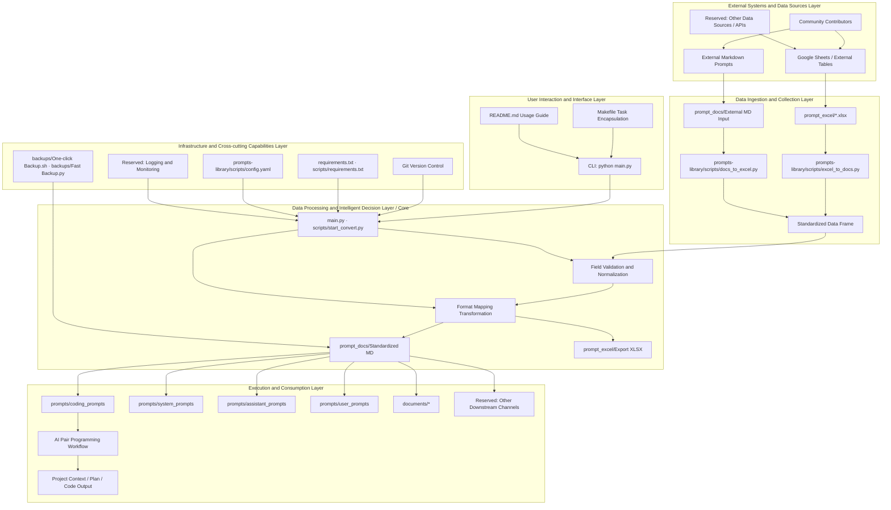
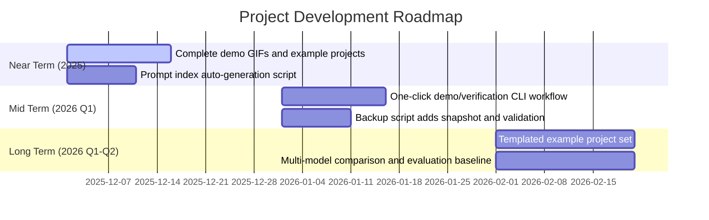

<!--
-------------------------------------------------------------------------------
  Project Header Area (HEADER)
-------------------------------------------------------------------------------
-->
<p align="center">
  <!-- Recommended size: 1280x640px. Can be created using tools like Canva, Figma or https://banners.beyondco.de/ -->
  
</p>

<div align="center">

# Vibe Coding Supreme Super Ultimate Invincible Guide V114514

**The ultimate workstation for bringing ideas to life through AI pair programming**

---

<!--
  Badges Area (BADGES)
-->
<p>
  <a href="https://github.com/tukuaiai/vibe-coding-cn/actions"></a>
  <a href="https://github.com/tukuaiai/vibe-coding-cn/releases"></a>
  <a href="LICENSE"></a>
  <a href="https://github.com/tukuaiai/vibe-coding-cn"></a>
  <a href="https://github.com/tukuaiai/vibe-coding-cn"></a>
  <a href="https://github.com/tukuaiai/vibe-coding-cn/graphs/contributors"></a>
  <a href="https://t.me/glue_coding"></a>
</p>

[📚 Related Documents](#-related-documents)
[🚀 Getting Started](#-getting-started)
[⚙️ Full Setup Process](#️-full-setup-process)
[📞 Contact Information](#-contact-information)
[✨ Sponsorship Address](#-sponsorship-address)
[🤝 Contributing](#-contributing)


</div>

---

## 🖼️ Overview

**Vibe Coding** is the ultimate workflow for AI pair programming, designed to help developers smoothly bring ideas to life. This guide details the entire process from project conception, technology selection, implementation planning to specific development, debugging, and expansion. It emphasizes **planning-driven** and **modularization** as the core, preventing AI from going out of control and leading to project chaos.

> **Core Philosophy**: *Planning is everything.* Be cautious about letting AI autonomously plan, otherwise your codebase will become an unmanageable mess.

## 🧭 The Way (Dao)

* **If AI can do it, don't do it manually.**
* **Ask AI everything.**
* **Context is the primary element of Vibe Coding; garbage in, garbage out.**
* **Systemic thinking: entities, links, functions/purposes, three dimensions.**
* **Data and functions are everything in programming.**
* **Input, process, output describe the entire process.**
* **Frequently ask AI: What is it? Why? How to do it?**
* **Structure first, then code; always plan the framework well, otherwise, technical debt will be endless.**
* **Occam's Razor: Do not add code if unnecessary.**
* **Pareto Principle: Focus on the important 20%.**
* **Reverse thinking: First clarify your requirements, then build code reversely from requirements.**
* **Repeat, try multiple times, if it really doesn't work, open a new window.**
* **Focus, extreme focus can penetrate code; do one thing at a time (except for divine beings).**

## 🧩 The Method (Fa)

* **One-sentence goal + non-goals.**
* **Orthogonality: functionality should not be too repetitive (this depends on the scenario).**
* **Copy, don't write: don't reinvent the wheel, first ask AI if there's a suitable repository, download and modify it.**
* **Always read the official documentation; first, feed the official documentation to AI.**
* **Split modules by responsibility.**
* **Interfaces first, implementation later.**
* **Change only one module at a time.**
* **Documentation is context, not an afterthought.**

## 🛠️ The Techniques (Shu)

* Clearly state: **What can be changed, what cannot be changed.**
* Debug only provide: **Expected vs. Actual + Minimum Reproduction.**
* Testing can be handed over to AI, **assertions human-reviewed.**
* Too much code, **switch sessions.**

## 📋 The Tools (Qi)

-   [**Claude Opus 4.5**](https://claude.ai/new), used in Claude Code, very expensive, but iOS subscription in some regions is hundreds of RMB cheaper, fast + good effect, top tier, has CLI and IDE plugins.
-   [**gpt-5.1-codex.1-codex (xhigh)**](https://chatgpt.com/codex/), used in Codex CLI, top tier, nothing to complain about except being slow, the only solution for large projects with complex logic, available with ChatGPT membership, has CLI and IDE plugins.
-   [**Droid**](https://factory.ai/news/terminal-bench), the Claude Opus 4.5 here is even stronger than Claude Code, top tier, has CLI.
-   [**Kiro**](https://kiro.dev/), the Claude Opus 4.5 here is currently free, but the CLI is a bit weak, can't see the running status, has client and CLI.
-   [**gemini**](https://geminicli.com/), currently free to use, for dirty work, can execute scripts written by Claude Code or Codex, also good for organizing documents and brainstorming, has client and CLI.
-   [**antigravity**](https://antigravity.google/), Google's, free to use Claude Opus 4.5 and Gemini 3.0 Pro, a great philanthropist.
-   [**aistudio**](https://aistudio.google.com/prompts/new_chat), from Google, free to use Gemini 3.0 Pro and Nano Banana.
-   [**gemini-enterprise**](https://cloud.google.com/gemini-enterprise), Google enterprise version, currently free to use Nano Banana Pro.
-   [**augment**](https://app.augmentcode.com/), its context engine and prompt optimization button are simply divine, beginners should just use it, click the button to automatically write prompts for you, a must-have for lazy people.
-   [**cursor**](https://cursor.com/), many people use it, haha.
-   [**Windsurf**](https://windsurf.com/), new users get free credits.
-   [**GitHub Copilot**](https://github.com/features/copilot), haven't used it.
-   [**kimik2**](https://www.kimi.com/), domestic, decent, used for dirty work and simple tasks, used to be 2 RMB per key, 1024 calls a week was pretty good.
-   [**GLM**](https://bigmodel.cn/), domestic, said to be very strong, heard it's similar to Claude Sonnet 4?
-   [**Qwen**](https://qwenlm.github.io/qwen-code-docs/zh/cli/), domestic from Alibaba, CLI has free credits.
-   [**Prompt Library, directly copy and paste for use**](https://docs.google.com/spreadsheets/d/1ngoQOhJqdguwNAilCl1joNwTje7FWWN9WiI2bo5VhpU/edit?gid=2093180351#gid=2093180351&range=A1)
-   [**Learning Library for System Prompts of Other Programming Tools**](https://github.com/x1xhlol/system-prompts-and-models-of-ai-tools)
-   [**Skills Maker (after AI downloads it, let AI use this repository to generate Skills according to your needs)**](https://github.com/yusufkaraaslan/Skill_Seekers)
-   [**Meta-prompts, prompts for generating prompts**](https://docs.google.com/spreadsheets/d/1ngoQOhJqdguwNAilCl1joNwTje7FWWN9WiI2bo5VhpU/edit?gid=1770874220#gid=1770874220)
-   [**General Project Architecture Template; this is the framework, copy it to AI to set up the directory structure with one click**](./documents/General%20Project%20Architecture%20Template.md) - Provides standard directory structures, core design principles, best practice recommendations, and technology selection references for various project types.
-   [**augment prompt optimizer**](https://app.augmentcode.com/), this prompt optimizer is really good, highly highly highly highly highly highly highly highly highly highly highly highly recommended.
-   [**Mind Map神器，让ai生成项目架构的.mmd图复制到这个里面就能可视化查看啦，，提示词在下面的“系统架构可视化生成Mermaid”里面**](https://www.mermaidchart.com/) - Mind Map神 tool, let AI generate project architecture .mmd diagrams, copy them here for visual viewing, the prompt is in "System Architecture Visualization Generation Mermaid" below.
-   [**notebooklm, for AI interpretation of materials and technical documents, listen to audio and view mind maps and Nano Banana generated images**](https://notebooklm.google.com/)
-   [**zread, AI repository reading tool, copy GitHub repository link to analyze, reduces the workload of using wheels**](https://zread.ai/)

---

## 📚 Related Documents/Resources

- [**Vibe Coding Discussion Group**](https://t.me/glue_coding)
- [**My Channel**](https://t.me/tradecat_ai_channel)
- [**Xiaodeng's Discourse: My Learning Experience**](./documents/Xiaodeng's%20Discourse.md)
- [**Recommended Programming Books**](./documents/Recommended%20Programming%20Books.md)
- [**Skills Generator, transform any material into agent's Skills**](https://github.com/yusufkaraaslan/Skill_Seekers)
- [**Google Sheets Prompt Database, my systematically collected and created hundreds of user prompts and system prompts for various scenarios**](https://docs.google.com/spreadsheets/d/1ngoQOhJqdguwNAilCl1joNwTje7FWWN9WiI2bo5VhpU/edit?gid=2093180351#gid=2093180351&range=A1)
- [**System Prompt Collection Repository**](https://github.com/x1xhlol/system-prompts-and-models-of-ai-tools)
- [**prompts-library Prompt Library XLSX and MD Folder Conversion Tool and Usage Instructions, with hundreds of prompts and meta-prompts for various fields**](./prompts-library/)
- [**coding_prompts My collected and created dozens of prompts suitable for Vibe Coding**](./prompts/coding_prompts/)
- [**Code Organization.md**](./documents/Code%20Organization.md)
- [**How to SSH to Local Computer from Any Location via FRP.md**](./documents/How%20to%20SSH%20to%20Local%20Computer%20from%20Any%20Location%20via%20FRP.md)
- [**Tool Collection.md**](./documents/Tool%20Collection.md)
- [**The Way of Programming.md**](./documents/The%20Way%20of%20Programming.md)
- [**Glue Coding.md**](./documents/Glue%20Coding.md)
- [**gluecoding.md**](./documents/gluecoding.md)
- [**CONTRIBUTING.md**](./CONTRIBUTING.md)
- [**CODE_OF_CONDUCT.md**](./CODE_OF_CONDUCT.md)
- [**System Prompt Construction Principles.md**](./documents/System%20Prompt%20Construction%20Principles.md) - A comprehensive guide exploring the core principles, communication interactions, task execution, coding standards, and security protection for building efficient and reliable AI system prompts.
- [**System Architecture Visualization Generation Mermaid**](./prompts/coding_prompts/System%20Architecture%20Visualization%20Generation%20Mermaid.md) - Generates .mmd from the project directly for importing into mind map websites to visually view architecture diagrams, sequence diagrams, etc.
- [**Development Experience.md**](./documents/Development%20Experience.md) - Detailed organization of development experience and project specifications, including variable naming, file structure, coding standards, system architecture principles, microservices, Redis, and message queues.
- [**vibe-coding-experience-collection.md**](./documents/vibe-coding-experience-collection.md) - Experience collection of AI development best practices and system prompt optimization techniques.
- [**General Project Architecture Template.md**](./documents/General%20Project%20Architecture%20Template.md) - Provides standard directory structures, core design principles, best practice recommendations, and technology selection references for various project types.
- [**auggie-mcp Detailed Configuration Document**](./documents/auggie-mcp%20Configuration%20Document.md) - Augment context engine mcp, very useful.
- [**system_prompts/**](./prompts/system_prompts/) - AI development system prompt collection, including multiple versions of development specifications and thinking frameworks (configurations 1-8).
  - `1/CLAUDE.md` - Developer code of conduct and engineering specifications
  - `2/CLAUDE.md` - ultrathink mode and architecture visualization specifications
  - `3/CLAUDE.md` - Creative thinking philosophy and execution confirmation mechanism
  - `4/CLAUDE.md` - Linus-level engineer service cognitive architecture
  - `5/CLAUDE.md` - Top programmer thinking framework and code taste
  - `6/CLAUDE.md` - Comprehensive version, integrating all best practices
  - `7/CLAUDE.md` - Reasoning and planning agent, specializing in complex task decomposition and highly reliable decision support
  - `8/CLAUDE.md` - Latest comprehensive version, top programmer serving Linus-level engineers, including complete meta-rules and cognitive architecture
  - `9/CLAUDE.md` - Failed simplified version, ineffective
  - `10/CLAUDE.md` - Latest comprehensive version, incorporating Augment context engine usage specifications and requirements

---

## ✉️ Contact Information

- **GitHub**: [tukuaiai](https://github.com/tukuaiai)
- **Telegram**: [@desci0](https://t.me/desci0)
- **X (Twitter)**: [@123olp](https://x.com/123olp)
- **Email**: `tukuai.ai@gmail.com`

---

### Project Directory Structure Overview

The core structure of this `vibe-coding-cn` project primarily revolves around knowledge management and the organization and automation of AI prompts. Below is a reorganized and simplified directory tree with explanations for each part:

```
.
├── CODE_OF_CONDUCT.md           # Community code of conduct, regulating contributor behavior.
├── CONTRIBUTING.md              # Contribution guide, explaining how to contribute to this project.
├── GEMINI.md                    # AI assistant context document, including project overview, tech stack, and file structure.
├── LICENSE                      # Open-source license file.
├── Makefile                     # Project automation scripts for code checking, building, etc.
├── README.md                    # Main project documentation, including project overview, usage guide, resource links, etc.
├── .gitignore                   # Git ignore file.
├── AGENTS.md                    # AI agent related documentation or configuration.
├── CLAUDE.md                    # AI assistant's core behavioral guidelines or configuration.
│
├── documents/                   # Stores various explanatory documents, experience summaries, and detailed configuration instructions.
│   ├── auggie-mcp Configuration Document.md      # Augment context engine configuration document.
│   ├── Code Organization.md                # Code organization and structure related documents.
│   ├── ... (other documents)
│
├── libs/                        # General library code for internal project modularization.
│   ├── common/                  # Common functional modules.
│   │   ├── __init__.py          # Python package initialization file.
│   │   ├── models/              # Model definitions.
│   │   │   └── __init__.py
│   │   └── utils/               # Utility functions.
│   │       └── __init__.py
│   ├── database/                # Database related modules.
│   │   └── .gitkeep             # Placeholder file, ensuring the directory is tracked by Git.
│   └── external/                # External integration modules.
│       └── .gitkeep             # Placeholder file, ensuring the directory is tracked by Git.
│
├── prompts/                     # Centralized storage for all types of AI prompts.
│   ├── assistant_prompts/       # Auxiliary prompts.
│   ├── coding_prompts/          # Prompt collection specifically for programming and code generation.
│   │   ├── ... (specific coding prompt files)
│   │
│   ├── prompts-library/         # Prompt library management tool (Excel-Markdown conversion)
│   │   ├── main.py              # Main entry for the prompt library management tool.
│   │   ├── scripts/             # Contains Excel and Markdown conversion scripts and configurations.
│   │   ├── prompt_excel/        # Stores raw prompt data in Excel format.
│   │   ├── prompt_docs/         # Stores Markdown prompt documents converted from Excel.
│   │   ├── ... (other prompts-library internal files)
│   │
│   ├── system_prompts/          # AI system-level prompts, used to set AI behavior and framework.
│   │   ├── CLAUDE.md/           # (Note: Files and directories under this path have the same name, may require user confirmation)
│   │   ├── ... (other system prompts)
│   │
│   └── user_prompts/            # User-defined or commonly used prompts.
│       ├── ASCII Art Generation.md         # ASCII art generation prompts.
│       ├── Data Pipeline.md            # Data pipeline processing prompts.
│       ├── ... (other user prompts)
│
└── backups/                     # Project backup scripts.
    ├── One-click Backup.sh                # Shell script for one-click backup.
    └── Fast Backup.py                # Python script for actual execution logic.
```

---

## 🖼️ Overview and Demo

In one sentence: Vibe Coding = **Planning-driven + Context-fixed + AI Pair Execution**, transforming "idea to maintainable code" into an auditable pipeline, rather than an uniteratable monolith.

**What you will get:**
- A systematic prompt toolchain: `prompts/system_prompts/` constrains AI behavioral boundaries, `prompts/coding_prompts/` provides full-link scripts for demand clarification, planning, and execution.
- Closed-loop delivery path: Requirement → Context document → Implementation plan → Step-by-step implementation → Self-testing → Progress recording, fully reviewable and transferable.
- Shared memory bank: Synchronize `project-context.md`, `progress.md`, etc., in `memory-bank/` (or your equivalent directory), allowing humans and AI to share the same source of truth.

**3-minute CLI demo (execute sequentially in Codex CLI / Claude Code)**
1) Copy your requirements, load `prompts/coding_prompts/(1,1)_#_📘_Project Context Document Generation_·_Engineering_Prompt (Professional Optimized Version).md` to generate `project-context.md`.
2) Load `prompts/coding_prompts/(3,1)_#_Process Standardization.md` to get an executable implementation plan and acceptance criteria for each step.
3) Use `prompts/coding_prompts/(5,1)_{content#_🚀_Intelligent Requirement Understanding and R&D Navigation Engine (Meta_R&D_Navigator_·.md` to drive AI to write code according to the plan; update `progress.md` and run tests or `make test` after each item is completed.

**Screen recording key points (for replacement with GIF)**
- Screen 1: Paste requirements → automatically generate context document.
- Screen 2: Generate implementation plan, check 3-5 tasks.
- Screen 3: AI writes the first module and runs tests successfully.
- It is recommended to save the screen recording as `documents/assets/vibe-coding-demo.gif` and then replace the link below.

<p align="center">
  
</p>

**Demo script (text version, can be directly fed to AI)**
- Example requirement: Help me write a weather query service with Redis cache using FastAPI (including Dockerfile and basic tests).
- Remind AI: Execute according to the prompt order 1→2→3 above; each step must provide acceptance instructions; prohibit generating monolithic files.
- Acceptance criteria: Interface return example, `docker build` and `pytest` all pass; README needs to supplement usage instructions and architectural summary.

> To quickly test the waters, paste your requirements as is to AI, chain them together with prompts 1-2-3, and you will get a deliverable process that is implementable, verifiable, and maintainable.

---

## ⚙️ Architecture and Workflow

Core Asset Mapping:
```
prompts/
  coding_prompts/        # Core prompts for demand clarification, planning, and execution chain
  system_prompts/        # System-level prompts constraining AI behavior
  assistant_prompts/     # Auxiliary/cooperative prompts
  user_prompts/          # Reusable user-side prompts
  prompts-library/       # Excel↔Markdown prompt conversion and indexing tool
documents/
  Code Organization.md, General Project Architecture Template.md, Development Experience.md, System Prompt Construction Principles.md, and other knowledge bases
backups/
  One-click Backup.sh, Fast Backup.py  # Local/remote snapshot scripts
```



---

<details>
<summary>📈 Performance Benchmarks (Optional)</summary>

This repository is positioned as a "workflow and prompts" library rather than a performance-oriented codebase. It is recommended to track the following observable metrics (currently primarily relying on manual recording, which can be scored/marked in `progress.md`):

| Metric | Meaning | Current Status/Suggestion |
|:---|:---|:---|
| Prompt Hit Rate | Proportion of generations that meet acceptance criteria on the first try | To be recorded; mark 0/1 after each task in progress.md |
| Turnaround Time | Time required from requirement to first runnable version | Mark timestamps during screen recording, or use CLI timer to track |
| Change Reproducibility | Whether context/progress/backup is updated synchronously | Manual update; add git tags/snapshots to backup scripts |
| Routine Coverage | Presence of minimum runnable examples/tests | Recommend keeping README + test cases for each example project |

</details>

---

## 🗺️ Roadmap



---

## 🚀 Getting Started (This is by the original author, not me, I updated what I think are the best models)
To start Vibe Coding, you only need one of the following two tools:
- **Claude Opus 4.5**, used in Claude Code
- **gpt-5.1-codex.1-codex (xhigh)**, used in Codex CLI

This guide applies to both the CLI terminal version and the VSCode extension version (both Codex and Claude Code have extensions, and their interfaces are updated).

*(Note: Earlier versions of this guide used **Grok 3**, later switched to **Gemini 2.5 Pro**, and now we are using **Claude 4.5** (or **gpt-5.1-codex.1-codex (xhigh)**))*

*(Note 2: If you want to use Cursor, please check version [1.1](https://github.com/EnzeD/vibe-coding/tree/1.1.1) of this guide, but we believe it is currently less powerful than Codex CLI or Claude Code)*

---

<details>
<summary><strong>⚙️ Full Setup Process</strong></summary>

<details>
<summary><strong>1. Game Design Document</strong></summary>

- Hand your game idea to **gpt-5.1-codex** or **Claude Opus 4.5** to generate a concise **Game Design Document** in Markdown format, named `game-design-document.md`.
- Review and refine it yourself to ensure it aligns with your vision. It can be very basic initially; the goal is to provide AI with the game structure and intent context. Do not over-design; it will be iterated later.
</details>

<details>
<summary><strong>2. Tech Stack and <code>CLAUDE.md</code> / <code>Agents.md</code></strong></summary>

- Ask **gpt-5.1-codex** or **Claude Opus 4.5** to recommend the most suitable tech stack for your game (e.g., ThreeJS + WebSocket for a multiplayer 3D game), save it as `tech-stack.md`.
  - Ask it to propose the **simplest yet most robust** tech stack.
- Open **Claude Code** or **Codex CLI** in your terminal and use the `/init` command. It will read the two `.md` files you've created and generate a set of rules to guide the large model correctly.
- **Key: Always review the generated rules.** Ensure the rules emphasize **modularization** (multiple files) and prohibit **monolithic files**. You may need to manually modify or supplement the rules.
  - **Extremely Important:** Some rules must be set to **"Always"** to force AI to read them before generating any code. For example, add the following rules and mark them as "Always"：
    > ```
    > # Important Note:
    > # Before writing any code, you must fully read memory-bank/@architecture.md (including full database structure).
    > # Before writing any code, you must fully read memory-bank/@game-design-document.md.
    > # After completing a major feature or milestone, you must update memory-bank/@architecture.md.
    > ```
  - Other (non-Always) rules should guide AI to follow best practices for your tech stack (e.g., networking, state management).
  - *If you want the cleanest code and most optimized project, this entire set of rule settings is mandatory.*
</details>

<details>
<summary><strong>3. Implementation Plan</strong></summary>

- Provide the following to **gpt-5.1-codex** or **Claude Opus 4.5**:
  - Game Design Document (`game-design-document.md`)
  - Tech Stack Recommendation (`tech-stack.md`)
- Ask it to generate a detailed **Implementation Plan** (Markdown format), containing a series of step-by-step instructions for AI developers.
  - Each step should be small and specific.
  - Each step must include tests to verify correctness.
  - Strictly no code - only write clear, specific instructions.
  - Focus on the **basic game** first; full features will be added later.
</details>

<details>
<summary><strong>4. Memory Bank</strong></summary>

- Create a new project folder and open it in VSCode.
- Create a subfolder `memory-bank` in the project root.
- Place the following files into `memory-bank`:
  - `game-design-document.md`
  - `tech-stack.md`
  - `implementation-plan.md`
  - `progress.md` (create an empty file to record completed steps)
  - `architecture.md` (create an empty file to record the purpose of each file)
</details>

</details>

<details>
<summary><strong>🎮 Vibe Coding Develops the Basic Game</strong></summary>

Now for the most exciting part!

<details>
<summary><strong>Ensure Everything is Clear</strong></summary>

- Open **Codex** or **Claude Code** in the VSCode extension, or launch Claude Code / Codex CLI in the project terminal.
- Prompt: Read all documents in `/memory-bank`. Is `implementation-plan.md` completely clear? What questions do you have for me to clarify, so that it is 100% clear to you?
- It will usually ask 9-10 questions. After answering all of them, ask it to modify `implementation-plan.md` based on your answers to make the plan more complete.
</details>

<details>
<summary><strong>Your First Implementation Prompt</strong></summary>

- Open **Codex** or **Claude Code** (extension or terminal).
- Prompt: Read all documents in `/memory-bank`, then execute step 1 of the implementation plan. I will be responsible for running tests. Do not start step 2 until I verify the tests pass. After verification, open `progress.md` to record what you've done for future developers' reference, and add new architectural insights to `architecture.md` explaining the purpose of each file.
- **Always** use "Ask" mode or "Plan Mode" (press `shift+tab` in Claude Code) first, and only let AI execute the step after you are satisfied.
- **Ultimate Vibe:** Install [Superwhisper](https://superwhisper.com) and chat casually with Claude or gpt-5.1-codex using voice, without typing.
</details>

<details>
<summary><strong>Workflow</strong></summary>

- After completing step 1:
  - Commit changes to Git (ask AI if you don't know how).
  - Start a new chat (`/new` or `/clear`).
  - Prompt: Read all files in memory-bank, read progress.md to understand previous work progress, then continue with step 2 of the implementation plan. Do not start step 3 until I verify the tests.
- Repeat this process until the entire `implementation-plan.md` is completed.
</details>

</details>

<details>
<summary><strong>✨ Adding Detail Features</strong></summary>

Congratulations! You've built a basic game! It might still be rough and lack features, but now you can experiment and refine it as much as you want.
- Want fog effects, post-processing, special effects, sound effects? A better plane/car/castle? A beautiful sky?
- For each major feature added, create a new `feature-implementation.md` with short steps + tests.
- Continue incremental implementation and testing.

</details>

<details>
<summary><strong>🐞 Fixing Bugs and Getting Stuck</strong></summary>

<details>
<summary><strong>General Fixes</strong></summary>

- If a prompt fails or breaks the project:
  - Use `/rewind` in Claude Code to revert; for gpt-5.1-codex, commit frequently with Git and reset when needed.
- Error handling:
  - **JavaScript errors:** Open browser console (F12), copy error, paste to AI; for visual issues, send a screenshot.
  - **Lazy solution:** Install [BrowserTools](https://browsertools.agentdesk.ai/installation) to automatically copy errors and screenshots.
</details>

<details>
<summary><strong>Difficult Issues</strong></summary>

- Really stuck:
  - Revert to the previous git commit (`git reset`), try again with a new prompt.
- Extremely stuck:
  - Use [RepoPrompt](https://repoprompt.com/) or [uithub](https://uithub.com/) to synthesize the entire codebase into one file, then send it to **gpt-5.1-codex or Claude** for help.
</details>

</details>

<details>
<summary><strong>💡 Tips and Tricks</strong></summary>

<details>
<summary><strong>Claude Code & Codex Usage Tips</strong></summary>

- **Terminal version of Claude Code / Codex CLI:** Run in VSCode terminal to directly view diffs and feed context without leaving the workspace.
- **Claude Code's `/rewind`:** Instantly revert to a previous state when iteration goes off track.
- **Custom commands:** Create shortcuts like `/explain $param` to trigger prompts: "Analyze the code in depth to thoroughly understand how $param works. Tell me after you understand, then I will give you a new task." This allows the model to fully load context before modifying code.
- **Clean up context:** Frequently use `/clear` or `/compact` (to retain conversation history).
- **Time-saving trick (use at your own risk):** Use `claude --dangerously-skip-permissions` or `codex --yolo` to completely disable confirmation pop-ups.
</details>

<details>
<summary><strong>Other Useful Tips</strong></summary>

- **Small modifications:** Use gpt-5.1-codex (medium)
- **Write top-tier marketing copy:** Use Opus 4.1
- **Generate excellent 2D sprites:** Use ChatGPT + Nano Banana
- **Generate music:** Use Suno
- **Generate sound effects:** Use ElevenLabs
- **Generate videos:** Use Sora 2
- **Improve prompt effectiveness:**
  - Add a sentence: "Think slowly, no rush, it's important to strictly follow my instructions and execute perfectly. If my expression is not precise enough, please ask."
  - In Claude Code, the intensity of keywords to trigger deep thinking: `think` < `think hard` < `think harder` < `ultrathink`.
</details>

</details>

<details>
<summary><strong>❓ Frequently Asked Questions (FAQ)</strong></summary>

- **Q: I'm making an app, not a game, is the process the same?**
  - **A:** Essentially the same! Just replace GDD with PRD (Product Requirement Document). You can also quickly prototype with v0, Lovable, Bolt.new, then move the code to GitHub, and clone it locally to continue development using this guide.

- **Q: Your air combat game's plane model is amazing, but I can't make it with just one prompt!**
  - **A:** That wasn't one prompt, it was ~30 prompts + a dedicated `plane-implementation.md` file guided it. Use precise instructions like "cut space for ailerons on the wing," instead of vague instructions like "make a plane."

- **Q: Why are Claude Code or Codex CLI stronger than Cursor now?**
  - **A:** It's entirely a matter of personal preference. We emphasize that Claude Code can better leverage the power of Claude Opus 4.5, and Codex CLI can better leverage the power of gpt-5.1-codex. Cursor does not utilize either of these as well as their native terminal versions. Terminal versions can also work in any IDE, with SSH remote servers, etc., and features like custom commands, sub-agents, and hooks can significantly improve development quality and speed in the long run. Finally, even if you only have a low-tier Claude or ChatGPT subscription, it's completely sufficient.

- **Q: What if I don't know how to set up a multiplayer game server?**
  - **A:** Ask your AI.

</details>

---

## 📞 Contact Information

Twitter: https://x.com/123olp

Telegram: https://t.me/desci0

Telegram Discussion Group: https://t.me/glue_coding

Telegram Channel: https://t.me/tradecat_ai_channel

Email (may not be seen in time): tukuai.ai@gmail.com

---

## ✨ Sponsorship Address

Please help! My wallet has been drained by AIs. Please sponsor me for membership (you can contact me on TG or X) 🙏🙏🙏

**Tron (TRC20)**: `TQtBXCSTwLFHjBqTS4rNUp7ufiGx51BRey`

**Solana**: `HjYhozVf9AQmfv7yv79xSNs6uaEU5oUk2USasYQfUYau`

**Ethereum (ERC20)**: `0xa396923a71ee7D9480b346a17dDeEb2c0C287BBC`

**BNB Smart Chain (BEP20)**: `0xa396923a71ee7D9480b346a17dDeEb2c0C287BBC`

**Bitcoin**: `bc1plslluj3zq3snpnnczplu7ywf37h89dyudqua04pz4txwh8z5z5vsre7nlm`

**Sui**: `0xb720c98a48c77f2d49d375932b2867e793029e6337f1562522640e4f84203d2e`

**Binance UID Payment**: `572155580`

---

### ✨ Contributors

Thanks to all developers who contributed to this project!

<a href="https://github.com/tukuaiai/vibe-coding-cn/graphs/contributors">
  
  
</a>

---

## 🤝 Contributing

We warmly welcome all forms of contributions! If you have any ideas or suggestions for this project, please feel free to open an [Issue](https://github.com/tukuaiai/vibe-coding-cn/issues) or submit a [Pull Request](https://github.com/tukuaiai/vibe-coding-cn/pulls).

Before you start, please take some time to read our [**Contribution Guide (CONTRIBUTING.md)**](CONTRIBUTING.md) and [**Code of Conduct (CODE_OF_CONDUCT.md)**](CODE_OF_CONDUCT.md).

---

## 📜 License

This project is licensed under the [MIT](LICENSE) license.

---

<div align="center">

**If this project is helpful to you, please don't hesitate to give it a Star ⭐!**

## Star History

<a href="https://www.star-history.com/#tukuaiai/vibe-coding-cn&type=date&legend=top-left">
 <picture>
   <source media="(prefers-color-scheme: dark)" srcset="https://api.star-history.com/svg?repos=tukuaiai/vibe-coding-cn&type=date&theme=dark&legend=top-left" />
   <source media="(prefers-color-scheme: light)" srcset="https://api.star-history.com/svg?repos=tukuaiai/vibe-coding-cn&type=date&legend=top-left" />
   
 </picture>
</a>

---

**Made with ❤️ and a lot of ☕ by [tukuaiai](https://github.com/tukuaiai),[Nicolas Zullo](https://x.com/NicolasZu)and [123olp](https://x.com/123olp)**

[⬆ Back to Top](#vibe-coding-supreme-super-ultimate-invincible-guide-v114514)
