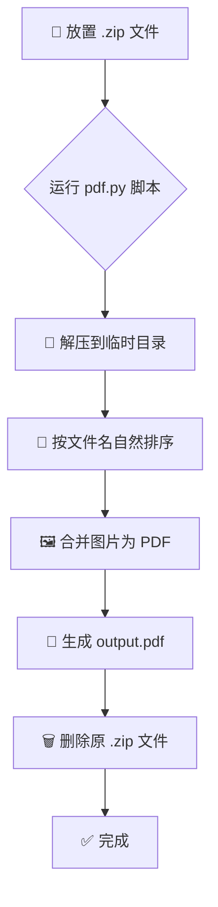

<div align="center">

# 📚 小红书图文批量转 PDF
### Batch Convert XHS Images to PDF

**一个智能 Python 脚本，用于将从小红书批量下载的 ZIP 压缩包，按顺序自动拼接为清晰的 PDF 文件。**
*A smart Python script that automatically converts ZIP archives from Xiaohongshu into well-ordered PDF files.*

---

[](https://opensource.org/licenses/MIT)
[]()
[]()
[]()

[✨ 功能特性](#-功能特性) • [⚙️ 工作流程](#️-工作流程) • [🚀 快速开始](#-快速开始) • [🗂️ 项目结构](#️-项目结构) • [🤝 参与贡献](#-参与贡献)

</div>

---

## ✨ 功能特性

| 特性 | 描述 |
|:---:|:---|
| 📦 **全自动处理** | 无需手动解压，脚本自动处理 `.zip` 压缩包。 |
| 🔢 **智能自然排序** | 完美处理 `1, 2, ... 10, 11` 这样的文件名排序，确保图片顺序正确。 |
| 🚀 **批量转换** | 支持一次性转换文件夹内的所有 `.zip` 文件，省时省力。 |
| 🗑️ **自动清理** | 转换成功后，自动删除原始的 `.zip` 文件和临时文件，保持目录整洁。 |
| 📖 **PDF 优化** | 生成的 PDF 文件经过优化，保证清晰度的同时控制文件大小。 |
| 💻 **跨平台兼容** | 依赖的 `Pillow` 库和 Python 脚本可在 Windows, macOS, Linux 上运行。 |

---

## ⚙️ 工作流程

<table>
<tr>
<td width="50%">

脚本的核心逻辑非常简单直接：监控并处理文件夹内的 ZIP 文件，通过一系列自动化步骤输出 PDF。

### 核心步骤
1.  **扫描**: 查找当前目录下的所有 `.zip` 文件。
2.  **解压**: 将找到的 `.zip` 文件解压到临时目录。
3.  **排序**: 智能地对所有图片文件进行“自然排序”。
4.  **合并**: 将排序后的图片合并成一个 PDF 文件。
5.  **清理**: 删除原始的 `.zip` 文件和临时文件夹。

</td>
<td width="50%">



</td>
</tr>
</table>

---

## 🚀 快速开始

### 1. 环境准备

首先，确保你的电脑上安装了 **Python 3**。

然后，将本项目克隆到你的本地：
```bash
git clone https://github.com/tukuaiai/XHS-image-to-PDF-conversion.git
cd XHS-image-to-PDF-conversion
```

### 2. 安装依赖

本项目依赖 `Pillow` 库来处理图片。运行以下命令安装它：
```bash
pip install -r requirements.txt
```
或者，你也可以使用 `Makefile` (如果你的系统支持 `make`):
```bash
make install
```

### 3. 下载图文

使用你喜欢的浏览器扩展（如推荐的 **小地瓜**）从小红书下载图文，并确保它们是 `.zip` 格式。

-   **小地瓜 - 小红书图片视频下载助手**: [Firefox 扩展](https://addons.mozilla.org/zh-CN/firefox/addon/%E5%B0%8F%E5%9C%B0%E7%93%9C-%E5%B0%8F%E7%BA%A2%E4%B9%A6%E5%9B%BE%E7%89%87%E8%A7%86%E9%A2%91%E4%B8%8B%E8%BD%BD%E5%8A%A9%E6%89%8B/)

### 4. 运行脚本

<details>
<summary><b>模式一：批量处理所有 ZIP 文件 (推荐)</b></summary>

1.  将所有下载的 `.zip` 文件移动到本项目文件夹中。
2.  直接运行 `pdf.bat` (Windows) 或在终端中运行以下命令：
    ```bash
    python pdf.py
    ```
    或者使用 `make`:
    ```bash
    make run
    ```
3.  脚本会自动处理文件夹内所有的 `.zip` 文件。

</details>

<details>
<summary><b>模式二：处理单个 ZIP 文件</b></summary>

如果你只想处理一个文件，可以使用拖放或命令行参数：

1.  **拖放 (Windows)**: 将一个 `.zip` 文件直接拖到 `pdf.bat` 图标上。
2.  **命令行**:
    ```bash
    python pdf.py "你的文件路径.zip"
    ```
</details>

---

## 🗂️ 项目结构

```
XHS-image-to-PDF-conversion/
├── .git/
├── docs/                # (未来可能添加的文档)
├── 📚...pdf            # (示例文件)
├── pdf.bat              # Windows 批处理脚本
├── pdf.py               # 核心 Python 脚本
├── Makefile             # 自动化命令
├── requirements.txt     # Python 依赖
├── README.md            # 你正在阅读的这个文件
├── LICENSE              # MIT 许可证
├── CODE_OF_CONDUCT.md   # 社区行为准则
└── CONTRIBUTING.md      # 贡献指南
```

---

## 🤝 参与贡献

我们欢迎任何形式的贡献！无论是报告 Bug、提出功能建议还是直接贡献代码。

请参考我们的 [**贡献指南 (CONTRIBUTING.md)**](CONTRIBUTING.md) 来了解如何参与。

---

## 📜 许可证

本项目采用 [MIT](LICENSE) 许可证。

---

<div align="center">

**如果这个项目对你有帮助，请给一个 Star ⭐！**

[](https://star-history.com/#tukuaiai/XHS-image-to-PDF-conversion&Date)

---

**Made with 🐍 & ❤️ by tukuaiai**

[⬆ 回到顶部](#-小红书图文批量转-pdf)

</div>
