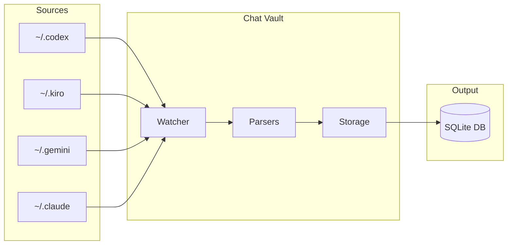
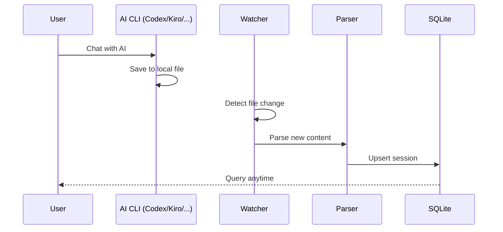
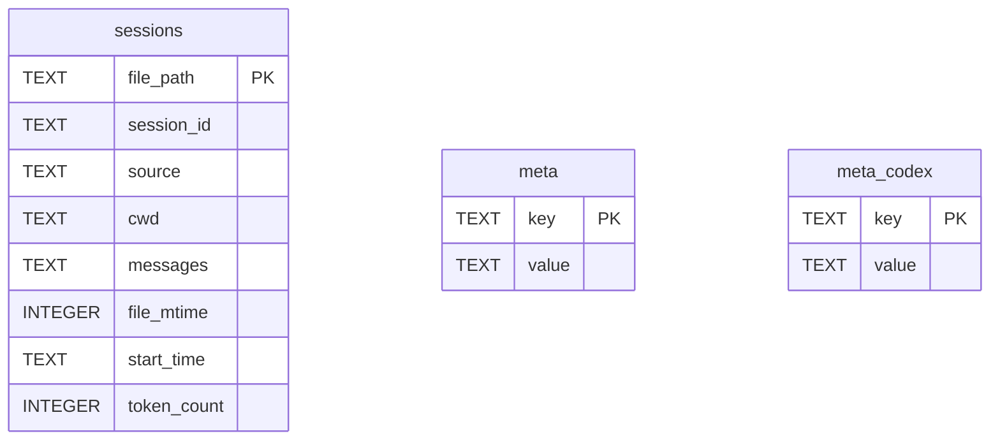

<div align="center">

# 🔐 Chat Vault

**One tool to save ALL your AI chat history**

[](https://python.org)
[](LICENSE)
[]()
[]()

[English](README.md) | [中文](README_CN.md)

[✨ Features](#-features) •
[🚀 Quick Start](#-quick-start) •
[📋 Commands](#-commands) •
[📁 Project Structure](#-project-structure) •
[❓ FAQ](#-faq)

[📞 Contact](#-contact) •
[✨ Support](#-support) •
[🤝 Contributing](#-contributing)

AI-powered docs: [zread.ai/tukuaiai/chat-vault](https://zread.ai/tukuaiai/chat-vault)

> 📦 This tool is part of [vibe-coding-cn](https://github.com/tukuaiai/vibe-coding-cn) - A comprehensive Vibe Coding guide

</div>

---

## ✨ Features

<table>
<tr>
<td>🔄 <b>Multi-CLI</b></td>
<td>Codex, Kiro, Gemini, Claude - all supported</td>
</tr>
<tr>
<td>⚡ <b>Real-time</b></td>
<td>Watch mode with system-level file monitoring</td>
</tr>
<tr>
<td>🔢 <b>Token Stats</b></td>
<td>Accurate counting using tiktoken (cl100k_base)</td>
</tr>
<tr>
<td>🔍 <b>Search</b></td>
<td>Find any conversation instantly</td>
</tr>
<tr>
<td>📤 <b>Export</b></td>
<td>JSON or CSV, your choice</td>
</tr>
<tr>
<td>🚀 <b>Zero Config</b></td>
<td>Auto-detects paths, just run it</td>
</tr>
</table>

---

## 🏗️ Architecture



---

## 🔄 How It Works



---

## 🚀 Quick Start

### 30 Seconds Setup

```bash
# Clone
git clone https://github.com/tukuaiai/vibe-coding-cn.git
cd vibe-coding-cn/libs/external/chat-vault

# Run (auto-installs dependencies)
./start.sh        # Linux/macOS
start.bat         # Windows
```

**That's it!** 🎉

---

## 📊 Example Output

```
==================================================
AI 聊天记录 → 集中存储
==================================================
数据库: ./output/chat_history.db

[Codex] 新增:1241 更新:0 跳过:0 错误:0
[Kiro] 新增:21 更新:0 跳过:0 错误:0
[Gemini] 新增:332 更新:0 跳过:0 错误:0
[Claude] 新增:168 更新:0 跳过:0 错误:0

==================================================
总计: 1762 会话, 40000+ 消息
✓ 同步完成!

=== Token 统计 (tiktoken) ===
  codex: 11,659,952 tokens
  kiro: 26,337 tokens
  gemini: 3,195,821 tokens
  claude: 29,725 tokens
  总计: 14,911,835 tokens
```

---

## 📋 Commands

| Command | Description |
|---------|-------------|
| `python src/main.py` | Sync once |
| `python src/main.py -w` | Watch mode (real-time) |
| `python src/main.py --stats` | Show statistics |
| `python src/main.py --search "keyword"` | Search messages |
| `python src/main.py --export json` | Export to JSON |
| `python src/main.py --export csv --source codex` | Export specific source |
| `python src/main.py --prune` | Clean orphaned records |

---

## 📁 Project Structure

```
chat-vault/
├── 🚀 start.sh / start.bat    # One-click start
├── 📦 build.py                # Build standalone exe
├── 📂 src/
│   ├── main.py                # CLI entry
│   ├── config.py              # Auto-detection
│   ├── storage.py             # SQLite + tiktoken
│   ├── watcher.py             # File monitoring
│   └── parsers/               # CLI parsers
├── 📂 docs/
│   ├── AI_PROMPT.md           # AI assistant guide
│   └── schema.md              # Database schema
└── 📂 output/
    ├── chat_history.db        # Your database
    └── logs/                   # Sync logs
```

---

## 🗄️ Database Schema



---

## 🤖 For AI Assistants

Send [docs/AI_PROMPT.md](docs/AI_PROMPT.md) to your AI assistant for:
- SQL query examples
- Python code snippets
- Task guidance

---

## ❓ FAQ

<details>
<summary><b>Do I need to configure anything?</b></summary>

No. Auto-detects `~/.codex`, `~/.kiro`, `~/.gemini`, `~/.claude`
</details>

<details>
<summary><b>Does it work with WSL?</b></summary>

Yes! Paths like `\\wsl.localhost\Ubuntu\...` are supported
</details>

<details>
<summary><b>How do I view the database?</b></summary>

Use [DB Browser for SQLite](https://sqlitebrowser.org/) or any SQLite tool
</details>

<details>
<summary><b>Is my data safe?</b></summary>

Yes. We only READ from AI tools, never modify original files
</details>

---

## 📞 Contact

- **GitHub**: [tukuaiai](https://github.com/tukuaiai)
- **Twitter / X**: [123olp](https://x.com/123olp)
- **Telegram**: [@desci0](https://t.me/desci0)
- **Telegram Group**: [glue_coding](https://t.me/glue_coding)
- **Telegram Channel**: [tradecat_ai_channel](https://t.me/tradecat_ai_channel)
- **Email**: tukuai.ai@gmail.com

---

## ✨ Support

If this project helped you, consider supporting:

- **Binance UID**: `572155580`
- **Tron (TRC20)**: `TQtBXCSTwLFHjBqTS4rNUp7ufiGx51BRey`
- **Solana**: `HjYhozVf9AQmfv7yv79xSNs6uaEU5oUk2USasYQfUYau`
- **Ethereum (ERC20)**: `0xa396923a71ee7D9480b346a17dDeEb2c0C287BBC`
- **BNB Smart Chain (BEP20)**: `0xa396923a71ee7D9480b346a17dDeEb2c0C287BBC`
- **Bitcoin**: `bc1plslluj3zq3snpnnczplu7ywf37h89dyudqua04pz4txwh8z5z5vsre7nlm`
- **Sui**: `0xb720c98a48c77f2d49d375932b2867e793029e6337f1562522640e4f84203d2e`

---

## 🤝 Contributing

We welcome all contributions! Feel free to open an [Issue](https://github.com/tukuaiai/vibe-coding-cn/issues) or submit a [Pull Request](https://github.com/tukuaiai/vibe-coding-cn/pulls).

---

## 📄 License

[MIT](LICENSE) - Do whatever you want with it.

---

<div align="center">

**If this helped you, give it a ⭐!**

## Star History

<a href="https://www.star-history.com/#tukuaiai/vibe-coding-cn&type=Date">
 <picture>
   <source media="(prefers-color-scheme: dark)" srcset="https://api.star-history.com/svg?repos=tukuaiai/vibe-coding-cn&type=Date&theme=dark" />
   <source media="(prefers-color-scheme: light)" srcset="https://api.star-history.com/svg?repos=tukuaiai/vibe-coding-cn&type=Date" />
   
 </picture>
</a>

---

**Made with ❤️ by [tukuaiai](https://github.com/tukuaiai)**

[⬆ Back to Top](#-chat-vault)

</div>
