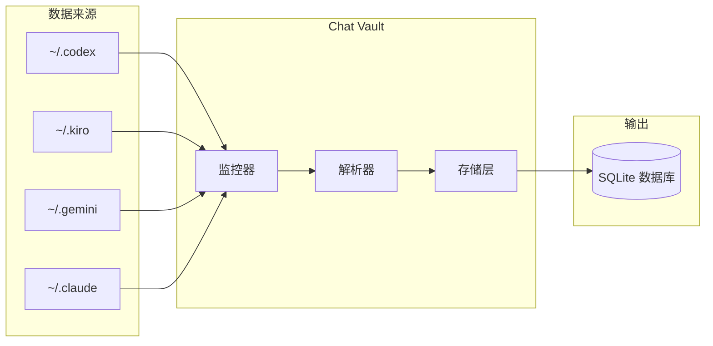
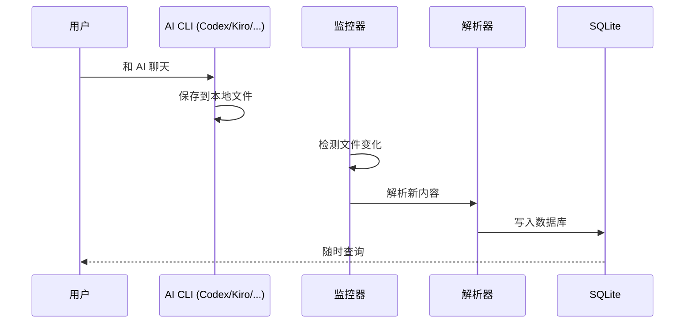
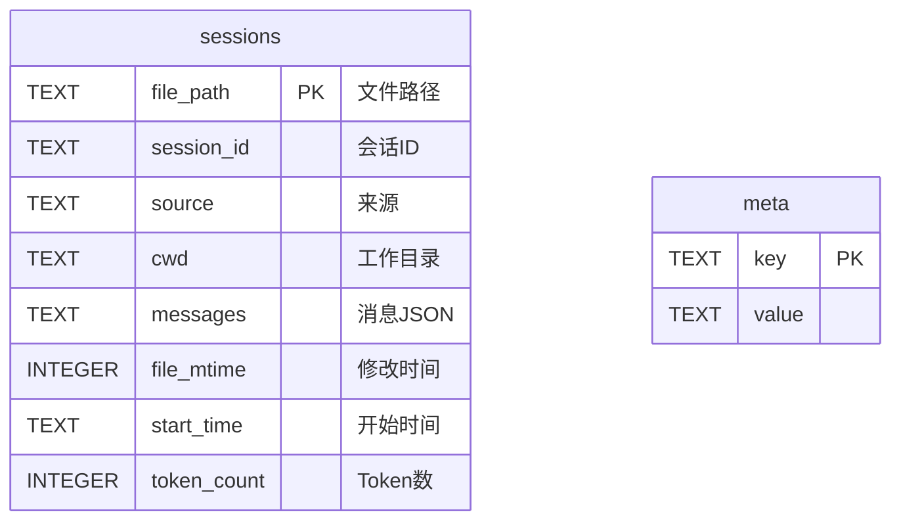

<div align="center">

# 🔐 Chat Vault

**一个工具保存你所有的 AI 聊天记录**

[](https://python.org)
[](LICENSE)
[]()
[]()

[English](README.md) | [中文](README_CN.md)

[✨ 功能特性](#-功能特性) •
[🚀 快速开始](#-30-秒快速开始) •
[📋 命令一览](#-命令一览) •
[📁 项目结构](#-项目结构) •
[❓ 常见问题](#-常见问题)

[📞 联系方式](#-联系方式) •
[✨ 支持项目](#-支持项目) •
[🤝 参与贡献](#-参与贡献)

AI 解读文档: [zread.ai/tukuaiai/chat-vault](https://zread.ai/tukuaiai/chat-vault)

> 📦 本工具是 [vibe-coding-cn](https://github.com/tukuaiai/vibe-coding-cn) 的一部分 - 一份全面的 Vibe Coding 指南

</div>

---

## ✨ 功能特性

<table>
<tr>
<td>🔄 <b>多 CLI 支持</b></td>
<td>Codex、Kiro、Gemini、Claude 全都行</td>
</tr>
<tr>
<td>⚡ <b>实时同步</b></td>
<td>系统级文件监控，聊完自动保存</td>
</tr>
<tr>
<td>🔢 <b>Token 统计</b></td>
<td>tiktoken 精确计算，知道你用了多少</td>
</tr>
<tr>
<td>🔍 <b>搜索</b></td>
<td>秒找任何对话</td>
</tr>
<tr>
<td>📤 <b>导出</b></td>
<td>JSON 或 CSV，随你选</td>
</tr>
<tr>
<td>🚀 <b>零配置</b></td>
<td>自动检测路径，开箱即用</td>
</tr>
</table>

---

## 🏗️ 架构图



---

## 🔄 工作流程



---

## 🚀 30 秒快速开始

```bash
# 下载
git clone https://github.com/tukuaiai/vibe-coding-cn.git
cd vibe-coding-cn/libs/external/chat-vault

# 运行（自动安装依赖）
./start.sh        # Linux/macOS
start.bat         # Windows（双击）
```

**搞定！** 🎉

---

## 📊 运行效果

```
==================================================
AI 聊天记录 → 集中存储
==================================================
数据库: ./output/chat_history.db

[Codex] 新增:1241 更新:0 跳过:0 错误:0
[Kiro] 新增:21 更新:0 跳过:0 错误:0
[Gemini] 新增:332 更新:0 跳过:0 错误:0
[Claude] 新增:168 更新:0 跳过:0 错误:0

==================================================
总计: 1762 会话, 40000+ 消息
✓ 同步完成!

=== Token 统计 (tiktoken) ===
  codex: 11,659,952 tokens
  kiro: 26,337 tokens
  gemini: 3,195,821 tokens
  claude: 29,725 tokens
  总计: 14,911,835 tokens
```

---

## 📋 命令一览

| 命令 | 说明 |
|------|------|
| `python src/main.py` | 同步一次 |
| `python src/main.py -w` | 实时监控（推荐） |
| `python src/main.py --stats` | 查看统计 |
| `python src/main.py --search "关键词"` | 搜索消息 |
| `python src/main.py --export json` | 导出 JSON |
| `python src/main.py --export csv --source codex` | 导出指定来源 |
| `python src/main.py --prune` | 清理孤立记录 |

---

## 📁 项目结构

```
chat-vault/
├── 🚀 start.sh / start.bat    # 一键启动
├── 📦 build.py                # 打包脚本
├── 📂 src/
│   ├── main.py                # 主程序
│   ├── config.py              # 配置检测
│   ├── storage.py             # SQLite + tiktoken
│   ├── watcher.py             # 文件监控
│   └── parsers/               # 各 CLI 解析器
├── 📂 docs/
│   ├── AI_PROMPT.md           # AI 助手指南
│   └── schema.md              # 数据库结构
└── 📂 output/
    ├── chat_history.db        # 你的数据库
    └── logs/                   # 日志
```

---

## 🗄️ 数据库结构



---

## 🤖 让 AI 帮你查数据库

把 [docs/AI_PROMPT.md](docs/AI_PROMPT.md) 发给 AI 助手，它就知道：
- 怎么写 SQL 查询
- 怎么用 Python 分析
- 怎么帮你找对话

---

## ❓ 常见问题

<details>
<summary><b>需要配置什么吗？</b></summary>

不用。自动检测 `~/.codex`、`~/.kiro`、`~/.gemini`、`~/.claude`
</details>

<details>
<summary><b>WSL 能用吗？</b></summary>

能！`\\wsl.localhost\Ubuntu\...` 这种路径也支持
</details>

<details>
<summary><b>怎么看数据库？</b></summary>

用 [DB Browser for SQLite](https://sqlitebrowser.org/) 或任何 SQLite 工具
</details>

<details>
<summary><b>会不会搞坏我的数据？</b></summary>

不会。只读取，从不修改原始文件
</details>

---

## 📞 联系方式

- **GitHub**: [tukuaiai](https://github.com/tukuaiai)
- **Twitter / X**: [123olp](https://x.com/123olp)
- **Telegram**: [@desci0](https://t.me/desci0)
- **Telegram 交流群**: [glue_coding](https://t.me/glue_coding)
- **Telegram 频道**: [tradecat_ai_channel](https://t.me/tradecat_ai_channel)
- **邮箱**: tukuai.ai@gmail.com

---

## ✨ 支持项目

如果这个项目帮到你了，考虑支持一下：

- **币安 UID**: `572155580`
- **Tron (TRC20)**: `TQtBXCSTwLFHjBqTS4rNUp7ufiGx51BRey`
- **Solana**: `HjYhozVf9AQmfv7yv79xSNs6uaEU5oUk2USasYQfUYau`
- **Ethereum (ERC20)**: `0xa396923a71ee7D9480b346a17dDeEb2c0C287BBC`
- **BNB Smart Chain (BEP20)**: `0xa396923a71ee7D9480b346a17dDeEb2c0C287BBC`
- **Bitcoin**: `bc1plslluj3zq3snpnnczplu7ywf37h89dyudqua04pz4txwh8z5z5vsre7nlm`
- **Sui**: `0xb720c98a48c77f2d49d375932b2867e793029e6337f1562522640e4f84203d2e`

---

## 🤝 参与贡献

欢迎各种形式的贡献！随时开启一个 [Issue](https://github.com/tukuaiai/vibe-coding-cn/issues) 或提交 [Pull Request](https://github.com/tukuaiai/vibe-coding-cn/pulls)。

---

## 📄 开源协议

[MIT](LICENSE) - 随便用，不用管我

---

<div align="center">

**如果帮到你了，点个 ⭐ 呗！**

## Star History

<a href="https://www.star-history.com/#tukuaiai/vibe-coding-cn&type=Date">
 <picture>
   <source media="(prefers-color-scheme: dark)" srcset="https://api.star-history.com/svg?repos=tukuaiai/vibe-coding-cn&type=Date&theme=dark" />
   <source media="(prefers-color-scheme: light)" srcset="https://api.star-history.com/svg?repos=tukuaiai/vibe-coding-cn&type=Date" />
   
 </picture>
</a>

---

**Made with ❤️ by [tukuaiai](https://github.com/tukuaiai)**

[⬆ 返回顶部](#-chat-vault)

</div>
