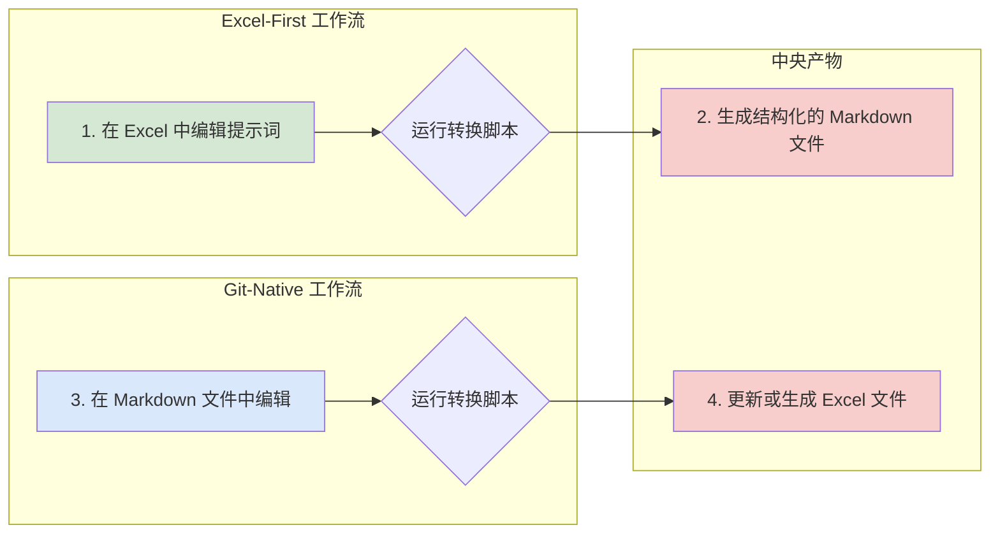
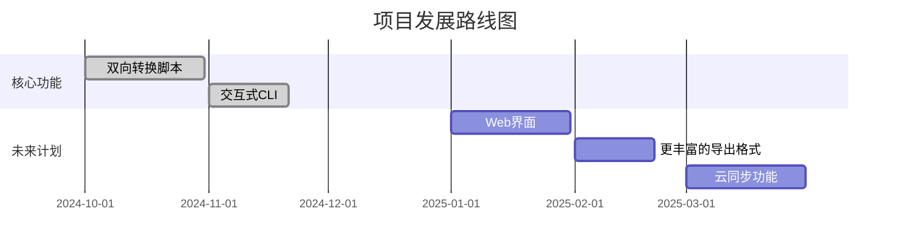

<!--
-------------------------------------------------------------------------------
  项目头部区域 (HEADER)
  这是用户第一眼看到的地方。一个精美的横幅或 Logo 能立刻提升专业感。
-------------------------------------------------------------------------------
-->
<p align="center">
  <!-- 建议尺寸: 1280x640px。可以使用 Canva, Figma 或 https://banners.beyondco.de/ 等工具制作 -->
  
</p>

<div align="center">

# Prompt Library

**一个全面的高质量AI提示词库，支持Excel和Markdown格式之间的双向转换。**

---

<!--
  徽章区域 (BADGES)
  从 https://shields.io/ 生成。选择与你的品牌色一致的颜色。
  建议包含：构建状态, 版本, 许可证, 语言, 代码大小, 下载量, 社区链接等。
-->
<p>
  <a href="https://github.com/tukuaiai/prompt-library/actions/workflows/sync.yml"></a>
  <a href="https://github.com/tukuaiai/prompt-library/releases"></a>
  <a href="LICENSE"></a>
  <a href="https://github.com/tukuaiai/prompt-library"></a>
  <a href="https://github.com/tukuaiai/prompt-library"></a>
</p>

[✨ 功能特性](#-功能特性) •
[🚀 快速开始](#-快速开始) •
[⚙️ API参考](#️-api参考) •
[🤝 参与贡献](#-参与贡献) •
[🗺️ 路线图](#️-路线图)

</div>

<!--
-------------------------------------------------------------------------------
  概览与核心视觉区域 (OVERVIEW & VISUALS)
  展示项目最直观的部分。
-------------------------------------------------------------------------------
-->

---

## 🖼️ 概览与演示

本词库是一个结构化的、高质量的AI提示词（Prompts）集合，旨在为开发人员、研究人员和内容创作者提供强大而灵活的工具。与许多静态的提示词列表不同，本项目提供了一个双向转换的工作流程，允许用户在易于协作的Excel格式和便于版本控制的Markdown格式之间无缝切换。

> **核心理念**: 让高质量的提示词像代码一样被管理、分享和迭代。

<p align="center">
  <!-- 建议使用 GIF，工具: ScreenToGif, GIPHY CAPTURE -->
  
</p>

---

<!--
-------------------------------------------------------------------------------
  主要内容区域 (MAIN CONTENT)
  详细介绍项目的方方面面。
-------------------------------------------------------------------------------
-->

## ✨ 功能特性

- 📊 **双向转换**: 支持Excel ↔️ Markdown格式互转，兼顾易用性与版本控制。
- 🗂️ **结构化管理**: 包含多个分类，覆盖从软件工程到哲学思辨的广泛领域。
- 🤖 **多平台兼容**: 提示词设计兼容Claude、GPT、Gemini等主流AI模型。
- 🛠️ **自动化工具**: 提供命令行工具，支持批量转换和管理。
- 🎨 **易于扩展**: 可以方便地添加新的提示词、分类和自定义属性。

---

## ⚙️ 架构与工作流程

本项目的工作流程围绕“以结构化数据为中心”的思想构建。


这个流程确保了无论是喜欢电子表格的非技术人员，还是习惯于Git和代码编辑器的开发人员，都可以高效地协作。

---

## 🚀 快速开始

### 1. 环境依赖

- [Python](https://www.python.org/) >= 3.8

### 2. 安装

<details>
<summary><b>从源码构建</b></summary>

```bash
git clone https://github.com/tukuaiai/prompt-library.git
cd prompt-library
pip install -r requirements.txt
```
</details>

### 3. 使用

<details>
<summary><b>Excel → Markdown 转换</b></summary>

```bash
# 运行交互式转换
python3 main.py
```
程序将扫描 `prompt_excel` 目录下的 `.xlsx` 文件，并让你选择一个进行转换。结果将输出到 `prompt_docs` 目录下一个带时间戳的文件夹中。
</details>

<details>
<summary><b>Markdown → Excel 转换</b></summary>

```bash
# 运行交互式转换
python3 main.py
```
程序将扫描 `prompt_docs` 目录，让你选择一个文档集，然后将其转换回 Excel 文件，并输出到 `prompt_excel` 目录下一个带时间戳的文件夹中。
</details>

<details>
<summary><b>非交互式转换</b></summary>

```bash
# 指定要转换的 Excel 文件
python3 main.py --select "prompt_excel/your_file.xlsx"

# 指定要转换的 Markdown 目录
python3 main.py --select "prompt_docs/your_docs_folder"
```

</details>

<details>
<summary><b>Gemini 无头：Markdown → JSONL 批处理</b></summary>

```bash
# 将目录中的 .md 提示词批量转为 JSONL（默认输入 2/，输出 2/prompts.jsonl）
python3 scripts/gemini_jsonl_batch.py --input 2 --output 2/prompts.jsonl --model gemini-2.5-flash
```

- 脚本内置固定系统提示词，调用 `gemini --allowed-tools '' --output-format text` 确保纯文本 JSONL。
- 需要本地已登录的 Gemini CLI；如需代理，请自行设置 `http_proxy/https_proxy` 环境变量。
- 可用 `-v` 查看逐文件处理日志，`--gemini-cmd` 自定义 CLI 可执行路径。
</details>

---

<details>
<summary>❓ 常见问题 (FAQ) (可选)</summary>

- **Q: 为什么转换会失败？**
  - **A:** 请确保您的Excel文件格式与提供的示例一致，特别是工作表（Sheet）的名称和列的标题。

- **Q: 我可以添加自己的转换逻辑吗？**
  - **A:** 当然可以。核心逻辑位于 `scripts/` 目录下，您可以自由修改或扩展它们。

</details>

---

<!--
-------------------------------------------------------------------------------
  社区与治理区域 (COMMUNITY & GOVERNANCE)
  展示项目的健康度和发展方向。
-------------------------------------------------------------------------------
-->

## 🗺️ 路线图



---

## 🤝 参与贡献

我们热烈欢迎各种形式的贡献！如果您对本项目有任何想法或建议，请随时开启一个 [Issue](https://github.com/tukuaiai/prompt-library/issues) 或提交一个 [Pull Request](https://github.com/tukuaiai/prompt-library/pulls)。

在您开始之前，请花点时间阅读我们的 [**贡献指南 (CONTRIBUTING.md)**](CONTRIBUTING.md) 和 [**行为准则 (CODE_OF_CONDUCT.md)**](CODE_OF_CONDUCT.md)。

### ✨ 贡献者们

感谢所有为本项目做出贡献的开发者！

<a href="https://github.com/tukuaiai/prompt-library/graphs/contributors">
  
</a>

---

## 🛡️ 安全策略

我们非常重视项目的安全性。如果您发现了任何安全漏洞，请不要公开讨论，而是通过电子邮件 `tukuaiai@example.com` 与我们联系。

---

<!--
-------------------------------------------------------------------------------
  页脚区域 (FOOTER)
  最后的行动号召和感谢。
-------------------------------------------------------------------------------
-->

## 📜 许可证

本项目采用 [MIT](LICENSE) 许可证。

---

<div align="center">

**如果这个项目对您有帮助，请不要吝啬您的 Star ⭐！**

<!-- Star History: https://star-history.com/ -->
<a href="https://star-history.com/#tukuaiai/prompt-library&Date">
  
</a>

<br>

**Made with ❤️ by tukuaiai**

[⬆ 回到顶部](#prompt-library)

</div>
